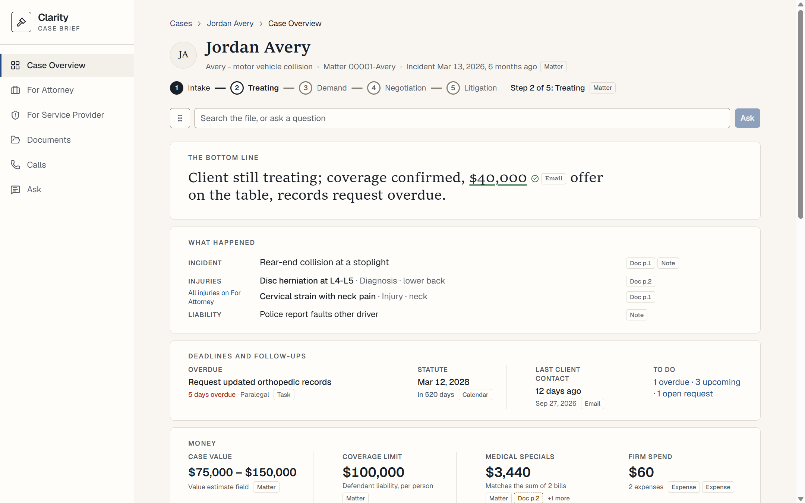
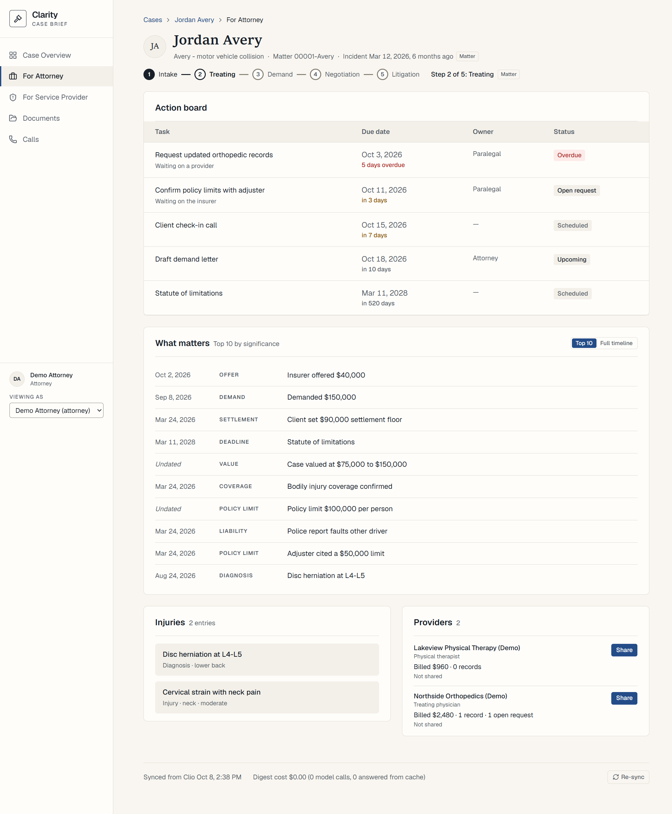
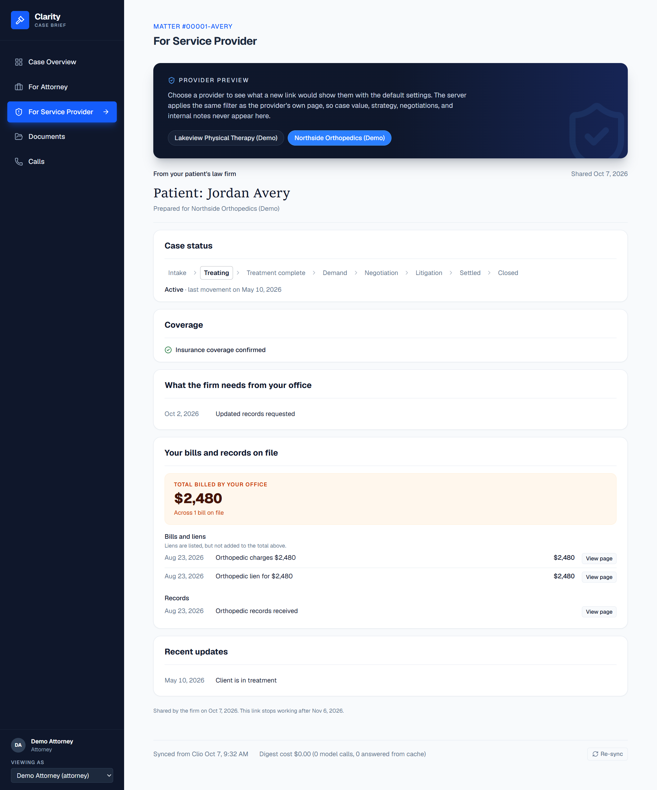
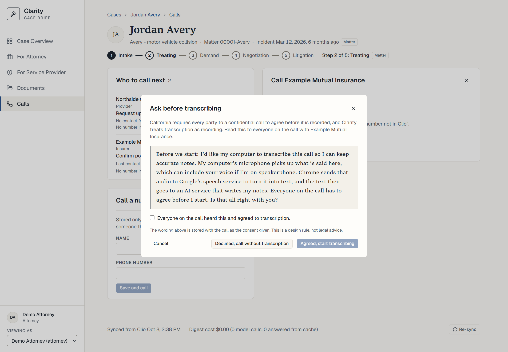
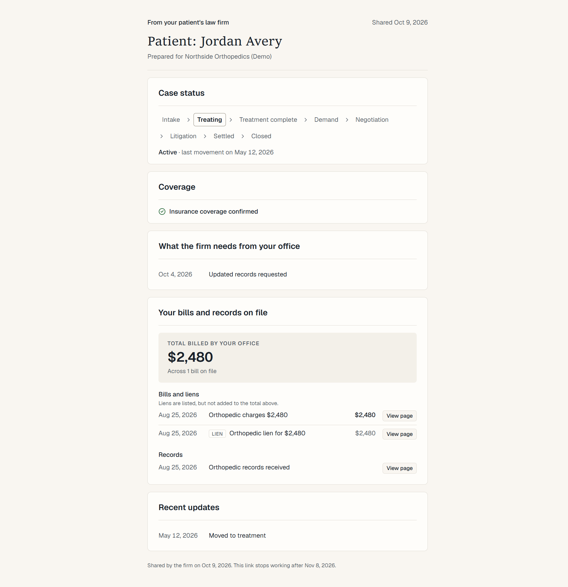
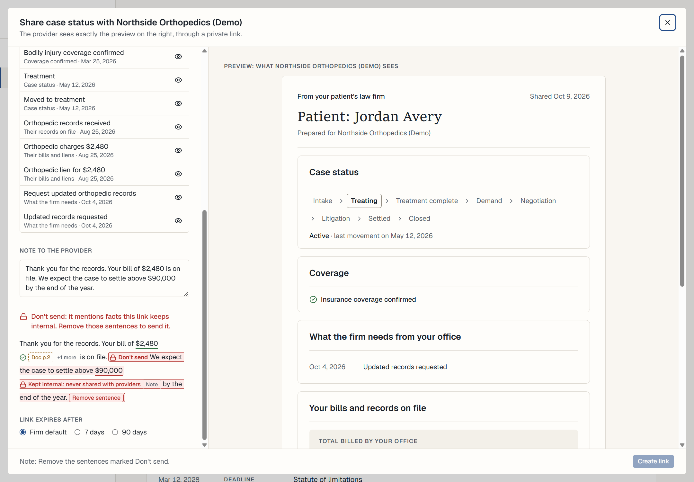

# Clarity

Clarity turns one personal-injury matter in Clio Manage into two views. The firm gets an Overview it can read in 90 seconds: what happened, where the case is now, the figures that matter, the key events in order, what changed since the last visit, and the brief's account in sentences. The medical providers treating the client on lien get a private link that shows only what the attorney releases: where the case stands, whether coverage is confirmed and, if the attorney allows, the defendant's liability limits, what the firm needs from them, and their own bills and records. Every date, amount and claim on screen opens the note, email or PDF page it came from, with the quote highlighted. Two tools sit on the same fact store: a draft checker that tests each amount and date in a message to a provider against the file, says when a date is in the file but not on that provider's link, and locks a sentence that would disclose an internal figure; and a Calls view that lists who to call next and turns a call's transcript into notes, each citing the words it came from. Clio is read with GET requests only, and nothing is ever written back. Models run when the matter is digested, and when the firm asks for a call's notes. They never run when a page loads, and each result is stored and reused.

Built for the Swans Applied AI Hackathon (Law-Di-Gras, San Diego, October 2, 2026), then finished in a trial run by a team of agents (see [The trial](#the-trial)).

| Case Overview | For Attorney |
|---|---|
|  |  |
| **For Service Provider (the firm's preview)** | **Calls** |
|  |  |
| **The provider's own page** | **The draft checker, in the share composer** |
|  |  |

The screenshots show the invented matter that `cli seed-dev` loads, never the real one: a screenshot of the real matter would commit a real person's medical details (D33).

## Run it

You need Python 3.11 or later, Node 20 or later, and Git. Clarity runs on localhost: the API on port 8000, the web app on port 5173.

### Without Clio: the invented matter

This is the path a clean clone takes. It needs no Clio account and no model key.

**macOS or Linux**

```bash
git clone --branch kit-trial https://github.com/aokhader/Clarity.git && cd Clarity
cp .env.example .env

cd backend
python3 -m venv .venv
source .venv/bin/activate
pip install -r requirements.txt
python -m app.cli seed-dev        # loads the invented matter as matter 1
uvicorn app.main:app --port 8000  # leave running; use a second terminal for the rest
```

```bash
cd Clarity/frontend
npm install
npm run dev                       # http://localhost:5173, forwards /api to port 8000
```

**Windows (PowerShell)**

```powershell
git clone --branch kit-trial https://github.com/aokhader/Clarity.git; cd Clarity
Copy-Item .env.example .env

cd backend
python -m venv .venv
.venv\Scripts\Activate.ps1        # in Git Bash: source .venv/Scripts/activate
pip install -r requirements.txt
python -m app.cli seed-dev
uvicorn app.main:app --port 8000
```

```powershell
cd Clarity\frontend
npm install
npm run dev
```

If PowerShell refuses to run `Activate.ps1`, skip activation and call the environment's Python directly, such as `.venv\Scripts\python -m pip install -r requirements.txt`.

Open `http://localhost:5173/`. It lists the matters; the invented one is at `/matters/1`. The views are in the left rail; in a window narrower than 1024 px, the rail folds into a top bar and the views are under **Menu**. To make a provider link, open **For Attorney** and use **Share** in the Providers panel. The link opens at `/p/<token>`.

**Measured on a clean clone** of commit `189e7ec` on Windows 11 (Git Bash), with Python 3.14.8 and Node 22.23.1, on 2026-10-07.
- PowerShell was used only to check that `Activate.ps1` works.
- pip and npm had packages cached from earlier installs on that machine, so a first install elsewhere will take longer.
- The clone came from a local disk, not GitHub.
- The macOS and Linux commands were not run.

| Step | Time |
|---|---|
| `python -m venv .venv` | 12.9 s |
| `pip install -r requirements.txt` | 37.0 s |
| `python -m app.cli seed-dev` | 2.5 s |
| `npm install` | 21.8 s |
| `npm run dev`, until Vite is ready | 1.3 s |
| The steps above together, until the page is served | about 76 s |
| `pytest -q` (341 passed) | 63.4 s |
| `bash scripts/check.sh` | 67.9 s |

On the invented matter, with no model configured, each matter route called in the clean clone answered in under 35 ms: the header, brief, feed, actions, providers, injuries, timeline, changes, shares, calls and a fact's source. `npm install` reports 7 high-severity advisories, all in the dependency tree of the `shadcn` package; see [Half-done or stubbed](#half-done-or-stubbed).

### With Clio: a real matter

Fill `.env` at the repository root. Every setting, with its default, is in `backend/app/config.py`.

- **Clio:** a developer application with read permissions (`CLIO_CLIENT_ID`, `CLIO_CLIENT_SECRET`). Register `http://127.0.0.1:8000/oauth/callback` as its redirect URI. `CLIO_MATTER_QUERY` is the search string that finds the matter.
- **Models:**
  - `LLM_PROVIDER` is `anthropic`, `openai` or `gemini`. The trial's runs used `anthropic`, with `claude-haiku-5-5` for extraction and `claude-sonnet-5-5` for the merge (D36). The October 2 digest used `claude-sonnet-5-5` and `claude-opus-5-5`.
  - `LLM_API_KEY`, `EXTRACT_MODEL` (vision-capable, one call per page or record) and `MERGE_MODEL` (mapping, significance and the brief).
  - The four `*_PRICE_*` settings, in USD per million tokens, so the cost can be computed.
  - `EXTRACT_RPM` and `MERGE_RPM` cap and space the requests per minute to each model (D31). `LLM_MAX_RETRY_WAIT_SECONDS` fails a call at once when the API asks for a longer wait; retry it later.

Then, from `backend/` with the environment active:

```bash
python -m app.cli auth      # once: prints Clio's sign-in URL and waits for the redirect
python -m app.cli sync      # pulls the matter's records and documents (GET only)
python -m app.cli digest    # pages -> facts -> brief; each model result is stored and reused
uvicorn app.main:app --port 8000
```

- **Auth** listens on port 8000 for Clio's redirect, so stop the API server first. `auth --manual` lets you paste the redirect URL instead.
- **The one non-GET request** this project sends to Clio is OAuth's token exchange, which touches no case data.
- **Other commands:**
  - `cli digest --retry-failed` retries model calls that failed.
  - `cli digest --pages-only` renders pages without calling a model.
  - `cli reextract --dry-run` prices a re-read of chosen pages before running it. `--keep-brief` re-reads them and scores their new facts but leaves the stored brief for the next digest to write.
  - `cli upgrade-schema`, with the API stopped, backs up `data/app.db` to `data/backups/app-<time>-pre-upgrade.db` and checks the copy's integrity. It then rebuilds any table whose constraint lacks a new fact kind or source type, or says "Nothing to upgrade". `seed-dev` runs the upgrade itself.
  - `cli reset` deletes the database and every downloaded file. It refuses while `data/` holds backups; see Tooling, under Known issues.

Without credentials, each command stops with a message, as seen in the clean clone:
- `auth` names the missing `CLIO_CLIENT_ID` and `CLIO_CLIENT_SECRET`.
- `sync` says "No Clio token stored".
- `digest` builds the facts that need no model, then says "Set EXTRACT_MODEL and MERGE_MODEL in .env".

### Checks

`bash scripts/check.sh`, from the repository root (Git Bash on Windows), runs what a screener would:
- ruff
- the Clio client's GET-only tests
- a scan for case data
- a scan for private files
- the backend tests
- the strict TypeScript check
- any other Node tests under `tests/`. There are none, so this step always reports SKIPPED.

Each step prints ok, FAIL or SKIPPED, and SKIPPED means the step verified nothing. The case-data step derives its forbidden terms from the synced matter in `data/app.db`. On a clone holding only the invented matter, it reports SKIPPED and says why.

## What works

### The views

The firm side has five views in the rail: Case Overview, For Attorney, For Service Provider (the firm's preview of a provider's link), Documents and Calls. This section is read from the code under `frontend/src/components/firm/` at `6cb901b`, after the Overview pass (D38, D39) and the fixes from the critic's fourth pass (D40). What has been seen running is under [Verified](#verified) and [Built, lightly tested](#built-lightly-tested).

**On every view, the identity header:**
- a breadcrumb (Cases, the client, the view);
- the client's photo from Clio, or initials, and the client's name;
- a case line: Clio's description, the matter number, and the incident date with its age and a source chip;
- the stage on a five-step track, "Step N of 5" in words, an "inferred" marker when the stage was inferred, and its chips. The steps before the current one are filled but carry no check mark and are not called completed, since a case in litigation can still be treating (D40). Only a settled or closed case completes the track.

**Case Overview**, the 90-second read, on one sheet from top to bottom:
1. **The bottom line:** the brief's headline, with its facts cited.
2. **What happened:** a missing line reads "Not found in file".
   - **Incident:** the account most records give, never Clio's date field (`incident_account`, D39).
   - **Injuries:** one row per body region, up to three, the region the most records state first. Each row shows the finding the most records give for that region; a tie goes to the treating providers. No injury count is shown, since the records restate one injury many times; a link opens all of them on For Attorney (D40).
   - **Liability:** the two most significant liability facts, so a contested point does not read as settled by one opinion (D40).
3. **Now:** in each cell, the value and its chip.
   - **Next step,** headed "Overdue" when the item it picks is overdue.
   - **Statute,** with its countdown in words. When the Clio task the statute was read from is complete, it reads "Met", with its date in neutral ink, never a red "passed" (D40).
   - **Last client contact.**
   - **To do:** the overdue, upcoming and open-request counts, which link to the action board. "Open requests" replaced "waiting on others", because a record request does not say who is waiting on whom (D40).
4. **Money:** the four tiles, Case value, Coverage limit, Medical specials and Firm spend. They moved here from For Attorney (D38).
5. **The story so far:** about ten key events from `GET /api/matters/{id}/key-events`, numbered, oldest first, each with its date and lane. Court events have their own kind, `litigation_event`: filed, served, answered, dismissed, renewed, a motion, an order, a hearing, a deposition, a trial, or other. Each is dated by its filing, service or decision date and is internal (D41). Up to three dated court events are pinned after the incident, whatever their score, and the other kinds fill the rest. Deadlines are left out, since a scheduled date does not say that anything happened (D40). "Full timeline" opens For Attorney with the timeline chosen.
6. **Since you last opened:** at most five changes, then a count of the rest. Hidden when nothing is new; one line on a first visit.
7. **Where it stands:** the brief's sentences, one per row, then "Not answered by the file", the brief's open questions.

In What happened, The story so far and Where it stands, each line's source chips sit in a right-hand margin beside it, so the sentence reads uninterrupted and keeps its own chips (D3). A figure the draft checker marks keeps its chip inline. For the incident account and each key event, the extra chips cite the other records that restate it, one chip per record, never one per page (D40).

**For Attorney:**
- the action board as a table: task, due date, owner and status, overdue first, with each task's title opening its source;
- What matters: the top 10 facts by significance, or the full timeline. The choice is in the URL (`?view=attorney&feed=timeline`);
- injuries, and providers with **Share**.

**Accessibility (D38).** What the lead measured is under [Verified](#verified). Built, and read from the code:
- every view reflows to 320 CSS px, and below 1024 px the rail becomes a top bar with a Menu button;
- a skip link to the matter;
- closing the source drawer returns focus to the chip that opened it;
- under each scanned page in the drawer, a "Page text" disclosure holds the page's text as its text alternative.

### Verified

Seen working on the hackathon's matter, and by whom.

- **The Overview pass (D38 to D40), measured by the lead on the real matter in Chrome on 2026-10-08:**
  - **The 90-second test, re-counted after D40 at 1440×900: 9 of the 12 questions** in `docs/ui.md` are answered on the first screen, above the fold at 900 px, against a target of at least 9.
    - Not on the first screen: whether the client is still treating, what changed lately, and what has happened so far in order.
    - The last two are answered within one scroll. That makes 11 of 12 within one scroll, short of the target of all 12.
    - Before D40 the lead counted 10. The tenth, whether the client is still treating, came only from the stage track's check mark. The critic found that the mark said treatment was complete when it was not (Pass 4, finding 4), and D40 removed it.
  - **Lighthouse's accessibility score, re-run after the Overview pass, is 100** on all five firm views and on the provider page at `/p/:token`.
  - **Reflow** at 640 and 320 CSS px, after D38. The top bar overflowed at 320 px until `724c6e3` fixed it.
  - **The D40 fixes were in place for the re-count** (`fe07ba2` to `53523da`, code only, no model call, described under [The views](#the-views)): a met statute reads "Met"; earlier stages are not marked completed; injuries show one row per body region; liability shows two facts; "Overdue" heads the Now cell when its item is overdue; the count reads "open requests"; the story has no deadlines; restating records are counted once each. The lead did not report checking each fix on its own.
  - **Seen by the reviewer on 2026-10-08:**
    - through the API on the real matter, read-only: the story's 10 events include no deadline, and the incident account cites 9 records;
    - in the lead's screenshots of the invented matter: earlier stages filled with no check mark, "Overdue" heading the Now cell, and "1 open request".
  - Backend tests cover the key events and the incident account (`backend/tests/test_backend_key_events.py`, `test_backend_incident_account.py`). The reviewer has read the code and seen the lead's screenshots of the invented matter, not the real matter's screens.
- **The critic's fourth pass (C4, `docs/reviews/critic.md`), on the real matter on 2026-10-08:** through the API and the code at `e61aee2`, with no browser, and the database opened read-only.
  - It traced every block of the new Overview to its sources. Every chip it opened holds its text.
  - The incident account is a model fact, never the Clio field, and the money row agrees with the brief's figures.
  - Its first-screen findings were fixed in code under D40 (see the Overview pass entry above). What D40 left open is under Known issues.
- **Court events in the story (D41), on the real matter on 2026-10-08:**
  - **By the lead, through the API and the page:**
    - the story shows three court rows: the earlier suit, the summons and complaint, and the answer;
    - each is internal and opens its page;
    - the answer's quote is in its page's text, and the two scanned pages passed their second read.
  - **By the reviewer, through the API and the database, read-only:**
    - the story's 10 events include 3 `litigation_event` rows (two `filed`, one `answered`), each dated, internal, verified and cited to a document page;
    - the re-read behind them made 19 paid calls with no error (see [Cost per case](#cost-per-case)).
- **By the lead, in the browser, during the trial (2026-10-07):**
  - The brief's sentences, each ending in source chips that open the cited page (U1). That was the October 2 brief; the model runs of 2026-10-08 rewrote it (below). Since D38 the chips sit in the margin beside each sentence.
  - The source drawer, and the share preview's chips, which open their sources (U8).
  - The draft checker:
    - in the composer: the "don't send" lock, and removing a sentence (U4);
    - the brief's "differs from the file" mark (U7).
  - "No bills on file" in place of $0, and the Coverage tile's leading limit with the client's own policies labelled beneath it (U9). That was before the limits were re-read; for the tile since D37, see below.
  - Calls:
    - the list of whom to call, with chips;
    - a typed number;
    - the consent gate;
    - the notes state when no model is configured.
- **After the model runs of 2026-10-08 (D36; costs under [Cost per case](#cost-per-case)):**
  - The lead checked the results in the browser after both runs.
  - The reviewer checked them through the API, with the database opened read-only, at `f37a110`:
    - The brief has 5 sentences, down from 8, and every one cites facts. Its headline cites 4 facts (D14).
    - No sentence or headline figure is marked "differs from the file" or "not in the file". Two sentences state no amount or date, so they are "unchecked".
    - No open question asks for a date the header already shows (P11).
    - The stage label has no trailing space, and the ledger's medical charges carry the neutral title (P12).
    - 19 of the 20 policy limits name their policy (D19). The critic found two of them labelled as the client's when they are another party's (Known issues).
    - Economic damages and recovery caps are kinds of their own (D20), and the Case value and Medical specials tiles cite neither.
    - Each provider's bill facts are unchanged by the runs: the same amounts, sources and pages as in the backup taken before them. So every provider's total is unchanged.
  - The critic's third pass (C3, `docs/reviews/critic.md`) traced the rewritten brief, the Coverage tile, the Case value and Medical specials tiles, all ten provider totals, and each re-read record. Every amount and date in the brief checks out. Its open findings are under Known issues.
- **After the critic's third-pass fixes (D37), seen by the reviewer through the API at `10ffbb3`:**
  - **The Coverage figure** has 7 rows in the API, leads with the defendant's per-person limit, and carries no warning. Since D38 the tile shows the lead and one more limit, with the rest behind a disclosure (`e2142ac`). A limit that names no policy or no per-person or per-occurrence basis is folded into the row whose figure it repeats. Where limits genuinely conflict, the tile keeps its lead and adds "Sources disagree on some limits" beneath it (read from `KpiTile.tsx`; the invented matter's two defendant figures raise the flag).
  - **A provider's coverage limits:** with every setting on, an unsaved preview for one provider released only the defendant's liability limits. That was 10 facts, shown on the page as two labelled limits, per person and per occurrence. The client's own policies stay with the firm.
  - **The draft checker** answers `not_on_link`, "In the file, not on this link", for the incident date in a draft to a provider whose link does not carry it. An invented date is still `not_in_file`.
- **After the re-sync of 2026-10-07 (D30), seen by the reviewer through the API on 2026-10-08:**
  - The sync fetched again the one pleading whose download had failed on October 2, and the next digest rendered it. All 27 of its page images now load.
  - All 31 documents carry Clio's received date, which the source drawer shows as the document's own date.
- **By the lead, outside the browser:**
  - The draft checker's server side on the real matter (B1).
  - The in-place schema upgrade on the real database, with all 14 tables keeping their row counts (D24).
- **By the critic, through the API with the database opened read-only, in two passes** (at commits `9c05e39` and `c18388b`; `docs/reviews/critic.md`):
  - All ten providers were previewed with every setting on, and no internal or strategy-flagged fact reached a payload.
  - The firm view's update text for all ten providers came back supported from the draft checker, with no false lock.
  - The provider routes are three GETs.
  - No GET request reaches a model. Every firm route answered in 0.2 to 0.35 s with no model configured.

### Seen working in a clean clone

By the reviewer, on the invented matter, on 2026-10-07:
- The steps under [Without Clio](#without-clio-the-invented-matter), in Git Bash on Windows, and `sync` and `digest` with no credentials.
- `pytest`: 341 passed at `189e7ec`. In the main checkout, 466 pass at `5966d19`, through `check.sh` on 2026-10-08.
- `check.sh`: no step failed after `e22a5ae`. Before that commit, the case-data step failed falsely on the invented matter's own fixture.
- **After the Overview pass, on 2026-10-08:** the clone was pulled to the branch's head, not cloned afresh, and `cli seed-dev` reloaded the invented matter.
  - At `389927b`, every route the Overview calls answered 200 in under 20 ms: the header, the brief, key events, injuries, actions, the liability and deadline timelines, and the changes.
  - At `1707584`, after the fixture gained records that give an incident account (`0deb4a1`), the header's `incident_account` carries its text and one record restating it. `key-events` returned 10 events, oldest first, with that account's fact first.
  - At `889debf`, after D41, `seed-dev` first failed on the old schema, then passed after `upgrade_schema`. Since `5fb132f`, `seed-dev` upgrades its database itself. The story's 10 events then included the invented matter's court event. Both providers' previews listed one update, "Moved to treatment".
- Sharing:
  - A created link returns exactly what the preview showed.
  - A withdrawn link returns 410.
  - Five deliberate breaks of the provider filter in `services/visibility.py` were tried: the expiry and withdrawal check, another provider's bills, hidden items, strategy flags, and the shareable tag. Each one made the visibility and share tests fail.
- The draft checker:
  - A sentence restating a provider's own bill total is `supported`.
  - A figure held only in an internal note is `do_not_send`, with "Kept internal: never shared with providers" and a chip to that note.
  - An unknown date is `not_in_file`.
  - The server refuses a share whose note holds the internal figure (422) and accepts one that does not (201).
- After D35's backend change (`01d6e41`), a live link served each item in its bills list as a bill or a lien.

By the lead, in the browser, on the clean clone's invented matter:
- **On 2026-10-08, after D38 to D40:** the lead retook the six screenshots above from the clone at `6c58e37` (`506267f`), and the provider page and preview again after D41 (`c32693d`), whose Recent updates now read "Moved to treatment":
  - the Overview's first screen at 1440×900;
  - For Attorney and the provider preview as full pages;
  - Calls with the consent step, and the draft checker, at 1440×1000;
  - the provider page at 1280 px wide, as a full page.

  The reviewer checked each against its caption.
- **While taking the earlier set, on 2026-10-07,** the freeze fixes `b71b281`, `1b5c369` and `cfc121b` (D35):
  - the Case value range fits its tile, breaking after its dash;
  - on the provider page and the firm's preview, the list reads "Bills and liens", with a caption that liens are not added to the total;
  - each lien row is labelled "Lien", with its amount set apart from the bills;
  - and, in that set's other shots, the brief's chips, the consent step, and the draft checker's lock in the share composer.

### Built, lightly tested

Unit tests pass. None of these has been seen in the browser on the real matter since it was last changed.

- **The D37 screens:** the types check, and the reviewer has read the code but not seen these rendered.
  - **The brief's chips (`8d4b1fa`):** a sentence draws its document-page chips first, so a scanned page is among the two visible chips whenever the sentence cites one (`frontend/src/components/firm/BriefCitations.tsx`).
  - **The draft-check panel (`f267fc6`):** a `not_on_link` date is shown in a neutral tone with one chip and a count, under "Some dates are in the file but not on this link". It neither locks nor warns.
  - **The share settings:** "Policy limits" now reads "The defendant's liability limits only, per person and per occurrence".
- **Provider updates show stage moves only (D41, `764bd38`):**
  - A provider's "Recent updates" list only moves to a named stage, in labels written in code, such as "Moved to litigation". The status label the model writes never reaches a provider.
  - Before this, the firm's preview of a provider's link on the real matter showed a model-written label that disclosed a past dismissal and renewal. No link existed, so nothing was sent.
  - Tests: `backend/tests/test_backend_provider_updates.py` and `test_visibility.py`. The reviewer saw the clone's preview return "Moved to treatment" for both of the invented matter's providers, through the API, not the page.
- **Liens in the provider update (D35, `612945b`):** the "Send update" draft counts and totals bills only, and lists liens under a heading of their own. On the real matter no lien reaches a provider; see Known issues.

- **Draft-checker matching (D25, D28):**
  - It reads amounts written with k, grand, bucks, USD, a trailing or full-width dollar sign, or in words, plus bare figures of four or more digits.
  - It catches ranges, rounding, and an internal figure split across two amounts.
  - It counts the firm-spend total and call-note figures as internal.
  - A date locks only when it is the date of a sensitive internal fact (an offer, a demand, a settlement, a valuation, a limit) or of a legal deadline. A plain calendar entry does not lock.
- **Fixes since the critic's second pass:**
  - The Case value tile leads with the firm's own valuation.
  - A provider's "last movement" is left out when the latest change has no date.
  - The client's treating injuries are listed first.
  - The consent wording names every service the audio and transcript reach (D27).
- **Pipeline fixes (P2 to P7).** The re-sync and the two model runs on the real matter went through them with no failed item, so their failure paths were not exercised there.
  - A partly failed sync is pulled again (P2).
  - A sync stopped by any error is closed as failed (P3).
  - A failed mapping call keeps the previous mapping (P4).
  - The policy-limit cross-check (P5).
  - A second digest over unchanged inputs calls no model (P6). In run (b), the unchanged mapping calls and one record were answered from the cache.
- **Model access:**
  - The Gemini provider (D30) and its per-model request limit (D31). On the free tier, the trials got no answer in 12 attempts on 2026-10-07 (D34) and 4 answers in 14 attempts on 2026-10-08 (D36). So the runs moved to Anthropic, and no digest of the real matter has run on Gemini.
  - The "Retry failed calls" control (D29), which had not been clicked by the freeze. The runs had no failed call to retry.
- **Call notes from a transcript (C-P):** every note's quote is checked against the transcript. The real matter's database holds no notes made by a live model, and the Manager's test call (C-T) has not happened.

### Half-done or stubbed

From the stubs list in `STATUS.md`, the track files in `docs/tracks/`, `docs/progress.md`, and the critic's open findings.

**Stubs and shortcuts**
- **Firm users:**
  - No real authentication. Seeded stub users (Demo Attorney, Demo Paralegal, Demo Case Manager) are chosen with a header switcher (`backend/app/services/users.py`, `frontend/src/components/firm/UserSwitcher.tsx`).
  - Each stub user's first "last opened" date is seeded: 21 days ago, 7 days ago, and never (`backend/app/services/visits.py`).
- **Providers:**
  - Provider access is by an unguessable, expiring link only; there is no provider login.
  - "Send update" leaves the recipient blank, because no synced field holds the provider's email (`frontend/src/components/share/SendUpdateMenu.tsx`).
- **`cli seed-dev`** loads an invented matter for development, tests and the screenshots, including a handwritten brief (`backend/tests/fixtures/synthetic_matter.py`).- **What the sync and digest leave out:**
  - Clio's personal-injury endpoints (`/medical_records_details.json`, `/damages.json`) are not synced. Bills come from documents, notes and the expense ledger.
  - A Clio request falls back to a smaller field list if Clio rejects a field name.
  - Calendar entries all become deadlines, including treatment appointments. Only legal deadlines lock a draft (D28).
  - Time entries produce no facts, and firm spend counts non-time entries only.
- **The draft checker:**
  - It checks figures only. A sentence that discloses an internal fact without an amount or a date is `unchecked`, and the UI says so (D17).
  - A figure near an internal amount, but not equal to it, rounded to it, or in a range around it, is not flagged.
- **Pipeline:**
  - A sync or digest that fails before its run row exists is held in server memory, so a restart forgets it (`backend/app/services/jobs.py`).
  - A failed model call is not retried until `cli digest --retry-failed` or the footer's retry control (`backend/app/digest/llm.py`).
  - `cli reextract --dry-run` prices a selection from the average recorded cost per call, which is an upper bound (`backend/app/digest/reextract.py`).
  - A date said on a call without a year is placed at the nearest such day within six months, else left out (`backend/app/digest/call_notes.py`).
- **Page and link details:**
  - The provider page does not show the firm's name; no synced record carries it.
  - A live link cannot be edited. To change what a provider sees, withdraw it and share again.
  - The `requests` setting releases only open record requests and open tasks.
  - The `coverage_limits` setting releases only the defendant's liability limits, never the client's own policies (D37).

**Known issues**

The issues that waited on the re-digest, the re-read and the re-sync are resolved: the brief's unsourced figure, the headline without chips, the open question about a date on the page, the ledger bill's raw title, the missing pleading and the upload dates. Policy limits are now tagged by policy, all but one, though two carry the wrong tag (below). The Coverage tile's false "Sources disagree" after the re-read is fixed too (D37). What was seen is under [Verified](#verified). These remain:

- **Another party's liability policy is labelled "Client's other policy"** (critic Pass 3, finding 2).
  - The defense driver's own auto policy appears on the Coverage tile as two rows of the client's.
  - The policy field (D21) has no value for another party's liability, so the model chose the nearest one. An attorney reading the tile would think the client holds a second policy, and would miss a second source of recovery.
  - The fix is an added value in the contract, a prompt line and a re-read of one record. By the Manager's choice (D37), it is not made now.
  - Providers never see this policy, since a link releases only the defendant's limits (D37).
- **A hidden item on a share comes back after a re-digest that rebuilds its fact** (critic Pass 3, finding 5).
  - A share stores hidden items by fact id (`Share.hidden_fact_ids_json` in `backend/app/models.py`, read in `backend/app/services/visibility.py`). A re-digest that re-reads a record gives its facts new ids. The two model runs replaced 91 facts this way.
  - No share exists on the real matter, so nothing leaked. It is still a gap in rule 4, the provider boundary. Owner: backend, after the freeze.
- **The rewritten brief is accurate but thin** (critic Pass 3, finding 6).
  - Every amount and date in it checks out. But it leaves out what the defense medical exams found and the limitations defense the defendant pleaded. The old brief stated both.
  - What matters, the ranked feed on For Attorney, still shows both.
  - A one-line prompt change and one brief call, about 5 cents, would restore them; that is optional and needs the Manager's go-ahead.
  - The open questions state their premises without chips.
- **Court events in the story, after D41's re-read:**
  - **The dismissal and the renewal are read but undated,** so the story cannot place them.
  - **Notes and emails that describe court events stay kind `other`** until the record prompt's version is bumped. That bump would also re-read the matter's custom-field record, so it was held back (`33e620d`).
  - **The stored brief predates the court events,** since the re-read kept it (`--keep-brief`). The next full digest makes one brief call, about $0.05.
- **On the Overview, left open by D40** (critic Pass 4):
  - **Nothing within one scroll says whether the client is still treating,** by the lead's re-count after D40 on the real matter. It is the one question of the 90-second test that the Overview misses (see [Verified](#verified)).
  - **The open-request count mixes the firm's requests with demands made of the client.** About half of the 44, by the critic's count, are defense or carrier demands for the client's records, which the firm owes. A record request carries no direction. Adding one needs a prompt line and a re-read of the request records. Finding 7.
  - **Most of the records behind the incident account cannot be opened from the Overview.** On the real matter the account cites 9 records, one more than a margin will expand. So it shows two chips and "+7 more" as a plain count. The reviewer counted this through the API after D40. Finding 10.
  - **Defense medical exams sit in the Treatment lane** of the story, because a diagnosis maps to that lane. Their reports' own dates disagree with a firm note and the calendar, which put the exams about six months later. The chips support what is shown. Finding 10.
- **No full digest has run on the D36 models.** The whole-case cost at those models is an estimate; see [Cost per case](#cost-per-case).
- **Pages read before a provider was known never get that provider.** Two fixes are written up in `STATUS.md`; neither is built.
  - None of the real matter's 8 lien facts has a provider attached, as found during D35 and confirmed in the database.
  - A link's bills-and-liens setting releases only its own provider's facts, so no provider's link shows a lien on the real matter.
- **On the provider page and in the firm's lists:**
  - The "shared on" and "expires" dates are UTC days, so a link made in the evening, Pacific time, reads as made the next day (`backend/app/services/provider_view.py`).
  - A stored call records the consent wording but not which firm user confirmed it.
  - The provider's "File opened" date (from a note) and the header's opened date (from Clio) differ by two days, as of the critic's third pass.
  - The action board's open requests numbered 45, 26 of them undated, as of the critic's second pass.
- **Smaller issues:**
  - Deduplication deletes duplicate facts, so a source that had one gets new fact ids on the next run.
  - A re-sync pulls the matter named by `CLIO_MATTER_QUERY`, not necessarily the one on screen.
  - Each visit uses up the "since you last opened" block.
  - As of the critic's third pass:
    - the Case value tile lists the valuation a second time, as "At least" the same figure, from a fact whose low end alone was filled;
    - the ranked feed lists one treatment recommendation twice;
    - the re-read dropped two caveats that records state and no fact now holds. The critic found nothing lost that an attorney relies on.
  - The stored brief's `generated_at` still reads its first generation on October 2, though the runs rewrote its text on 2026-10-08. `f37a110` dates each later rewrite correctly, but this brief was written before it. The screen does not show this date.
- **Tooling:**
  - `npm install` reports 7 high-severity advisories, all in the dependency tree of `shadcn`, whose stylesheet the app imports. They have not been triaged.
  - On Windows, `uvicorn --reload` sometimes keeps serving old code; restart it if a new route returns 404.
  - The Vite proxy target is fixed at port 8000 (`frontend/vite.config.ts`).
  - **`cli reset` refuses while `data/` holds backups,** whether in `data/backups/` or the `app.db.bak-*` file an upgrade leaves beside the database. Move or delete them first. This is on purpose, so a reset cannot wipe the backups of a real file. In the reviewer's clone it refused, naming both, and deleted nothing.
  - **A database made before a new fact kind or source type refuses it** ("CHECK constraint failed") until `cli upgrade-schema` runs (see [With Clio](#with-clio-a-real-matter)). In the reviewer's clone, the command backed up the database, found the copy intact, and reported "Nothing to upgrade".

## Cost per case

Measured with `GET /api/ops/cost` and the `llm_calls` table, on the hackathon's matter. Every call is costed at the prices set in `.env` when it ran.

**One full digest, measured on October 2, 2026:**

| | Model | Calls | Cost |
|---|---|---|---|
| Extraction: one call per page or record (361 pages in 31 documents, 112 records) | `claude-sonnet-5-5` | 473 | $5.86 |
| Merge: field and role mapping, significance, the brief | `claude-opus-5-5` | 41 | $1.79 |
| **One full digest** | | **514** | **$7.65** |

That is 1,728,515 input and 329,989 output tokens. Another 184 calls were rejected by the API (HTTP 400 or 401), and they used no tokens and cost nothing.
- **Reopening the matter costs nothing,** because no page load calls a model.
- **A second digest over unchanged inputs makes no model call,** because results are cached by input hash (`backend/tests/test_pipeline_second_digest.py`).

**The trial's model runs, measured on 2026-10-08 (D36, D41).** These ran on Anthropic's paid tier:
- extraction on `claude-haiku-5-5`, at $0.10 per million input tokens and $0.50 per million output tokens;
- the merge on `claude-sonnet-5-5`, at $2 and $10.

They re-ran only the calls whose prompts or inputs had changed, so they price an update, not a whole case. Run (a) re-digested the matter. Run (b) re-read 9 named records under the new extraction prompt (P13). Run (c) re-read 13 pleading pages under the court-event prompt with `cli reextract --keep-brief`, so the stored brief was kept (P14, D41).

| Run | Purpose | Model | Tokens in / out | Cost |
|---|---|---|---|---|
| (a) | Role mapping | `claude-sonnet-5-5` | 1,785 / 368 | $0.0073 |
| (a) | Field mapping | `claude-sonnet-5-5` | 2,311 / 378 | $0.0084 |
| (a) | Ledger classification | `claude-sonnet-5-5` | 3,742 / 737 | $0.0149 |
| (a) | The matter's record | `claude-haiku-5-5` | 3,503 / 4,961 | $0.0028 |
| (a) | Significance | `claude-sonnet-5-5` | 5,890 / 798 | $0.0198 |
| (a) | The brief | `claude-sonnet-5-5` | 19,064 / 663 | $0.0448 |
| (b) | 8 records re-read | `claude-haiku-5-5` | 23,507 / 13,744 | $0.0092 |
| (b) | Significance | `claude-sonnet-5-5` | 5,600 / 883 | $0.0200 |
| (b) | The brief | `claude-sonnet-5-5` | 20,167 / 639 | $0.0467 |
| (c) | 13 pleading pages re-read | `claude-haiku-5-5` | 66,826 / 21,071 | $0.0172 |
| (c) | 4 second reads of scanned figures | `claude-haiku-5-5` | 13,305 / 738 | $0.0017 |
| (c) | Significance, 2 calls | `claude-sonnet-5-5` | 6,895 / 981 | $0.0236 |

- **Run (a):** 6 calls, 36,295 input and 7,905 output tokens, $0.0979, and 38 s by its digest run's own record.
- **Run (b):** 10 paid calls and 4 answered from the cache (the three mapping calls and one record), 49,274 input and 15,266 output tokens, $0.0760, and 64 s.
- **Run (c):** 19 paid calls and 3 answered from the cache (the three mapping calls), 87,026 input and 22,790 output tokens, $0.0425, against a $1 stop. No call failed. A backup was taken first.
- **All three runs:** 35 paid calls, $0.2163. No call failed. Runs (a) and (b) ran against a $2 stop.
  - Pipeline reports no retries and no 429s.
  - Each run was tried first on a copy of the database: 6 calls for $0.0148 before (a) and (b), and 19 calls for $0.043 before (c), with no error. The copies are not in `app.db`, so these figures are from pipeline's reports.
- **`GET /api/ops/cost` now reports the matter's total:** 733 calls and 17 cache hits, 1,901,110 input and 375,950 output tokens, $7.87. That covers the October 2 digest, its 184 rejected calls, and the three runs. The reviewer read run (c) from the `llm_calls` table, with the database opened read-only.

**A whole case at the D36 models: about $1.40, an estimate, not measured.** No full digest has run on these models. The estimate prices the October 2 digest's tokens at the D36 rates:
- **Extraction, about $0.48 to $0.54.** The October 2 extraction used 1,481,705 input and 289,882 output tokens. On the same records, Haiku used 1.1 times the input and 2.2 to 2.5 times the output of the October 2 Sonnet calls (2.2 in pipeline's trial, 2.5 over the 9 records in the runs). The ratio was measured on records only, and most extraction calls read scanned pages.
- **The merge, about $0.89.** On October 2 it used 246,810 input and 40,107 output tokens on Opus. These are priced at Sonnet's rates, assuming Sonnet uses as many tokens.

## Where data lives

Everything Clarity derives stays on the machine that runs it. Nothing is written to Clio.

- **`data/`**, at the repository root, is gitignored. `DATA_DIR` in `.env` moves it.
  - **`app.db`**, SQLite, holds:
    - the synced Clio records, with their ETags;
    - page text;
    - every fact, with its source, page and verbatim quote;
    - the brief;
    - every model call, with its tokens, cost and cached response;
    - provider links and their opens, the stub users and their visits;
    - calls, transcripts and notes;
    - sync and digest runs;
    - Clio's OAuth tokens.
  - **`files/`** holds the downloaded documents, and **`pages/`** the rendered page images.
  - **`backups/`** holds the copy `cli upgrade-schema` takes before an upgrade, `app-<time>-pre-upgrade.db`.
  - **`app.db.bak-<time>`** is the copy `upgrade_schema` itself takes, beside the database, before upgrading it in place (D24). The copies taken by hand before each model run (D36) carry the same name.
  - **`raw-export.json`** exists only while `check.sh` runs its case-data step.
- **`.env`**, at the repository root, holds the Clio credentials and the model key. It is never committed.
- **Outside the machine:**
  - The model provider receives page images and record text during a digest, and a call's transcript when notes are requested. That was Anthropic for the October 2 digest and the trial's runs (D36).
  - The Gemini trials on copies of the real matter's database (D34, D36) sent some of its content to Google's free tier, whose terms allow Google to use it. D36 stopped this.
  - On a call, Chrome's speech recognition sends the microphone audio to Google's speech service. The consent step says so (D27).

## Repository map

```
backend/app/
  main.py, config.py, db.py, models.py, schemas.py   app, settings (the only reader of the environment), tables, API contract
  cli.py                     auth, sync, digest, reextract, seed-dev, upgrade-schema, reset
  clio/                      GET-only Clio client, OAuth, sync with ETags
  digest/                    pages -> facts -> brief
    pages.py, structured.py  PDF pages (PyMuPDF), and facts read from structured records in code
    extract.py, verify.py    one model call per page or record; a quote that is not in the input is dropped; money and dates on scans are read twice
    mapping.py, matter_fields.py, ledger.py   custom fields and contact roles mapped to canonical slots, so no matter's labels are in code
    merge.py, brief.py, cross_check.py        significance, the brief, and the specials and policy-limit cross-checks
    call_notes.py            notes from a call transcript, each quoting it
    llm.py                   every model call: cached by input hash, costed, rate-limited
    prompts/                 versioned prompt files
  services/                  queries and rules behind the routes
    visibility.py            visible_facts_for_share: the provider boundary, default-deny
    provider_view.py         the provider payload, built only from that function's output
    draft_check.py, money_mentions.py, text_mentions.py, known_values.py   the draft checker
    brief_check.py           brief figures checked against today's facts when served (D12)
    incident.py              the incident's date and the account most records give (D39)
    matter_queries.py        the header, the action board, the feed, the key events, the timeline and the injuries
    kpis.py, providers.py, calls.py, ...
  api/                       thin routes: matters, facts, shares, provider, calls, ops
backend/tests/               466 tests; fixtures/synthetic_matter.py is the invented matter
frontend/src/
  api/                       types.ts mirrors schemas.py; TanStack Query hooks
  pages/, components/        firm views (firm/), provider link and composer (share/), calls/, shared/
  lib/                       formatting, labels, consent wording, speech transcript
scripts/check.sh             the screener's checks; export_raw.py feeds the case-data scan
tests/                       repository-wide Node tests: no case data, nothing private
docs/                        architecture, digest pipeline, Clio API notes, UI, briefs, reviews, track history
.claude/                     agent roles, path ownership and its hook (the trial)
```

`docs/architecture.md` and `docs/digest-pipeline.md` explain the design. The shortest route through the code is:
1. `backend/app/clio/client.py`
2. `backend/app/digest/extract.py` with `verify.py`
3. `backend/app/services/visibility.py` with `backend/tests/test_visibility.py`

## The trial

After the hackathon, Clarity was finished on the `kit-trial` branch by a team of Claude Code sessions, with one human as Manager making the product calls.
- **The lead** (a session with no role) kept the plan, integrated the work, ran the servers, and checked screens in the browser.
- **Six workers** each held one role: pipeline, backend (which also kept the API contract), ui-builder, researcher, critic and reviewer.
- **Ownership:** each role could edit only the paths `.claude/ownership.json` gives it, and a hook (`.claude/hooks/enforce-ownership.mjs`) refused anything else.

The shared memory is plain files:
- **`PLAN.md`:** backlog with owners, milestones, cut order and the trial's measures.
- **`STATUS.md`:** one row per role, plus the stubs list.
- **`DECISIONS.md`:** D1 to D41, each with its time and reason.
- **`docs/briefs/`:** the researcher's briefs.
- **`docs/reviews/critic.md`:** the critic's ranked findings.

The trial added the draft checker (D2) and Calls (D8). It fixed most of the Track A review's pipeline defects and of the critic's findings; the rest are listed under Half-done. Features were frozen at D32. On 2026-10-08 the Manager reopened the UI for one pass, so the Overview answers in 90 seconds what the case is about, what has happened and where it stands (D38, D39); it made no model call. D40 fixed the critic's fourth-pass findings in code. D41 added court events to the story and limited provider updates to stage moves, with one paid re-read of the pleadings ($0.04). The commits are `git log 987c1bf..kit-trial`.
