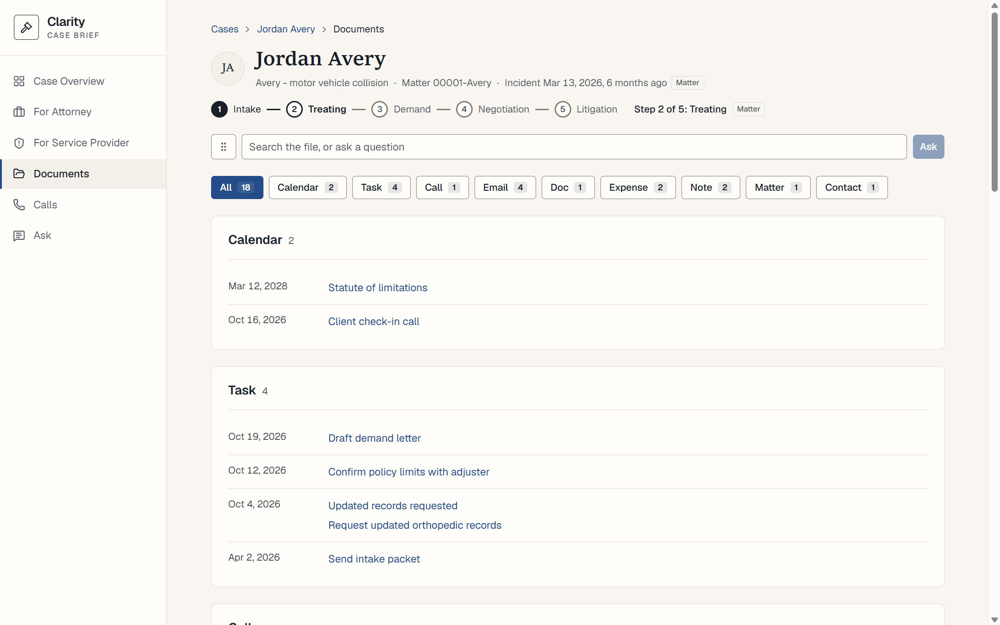
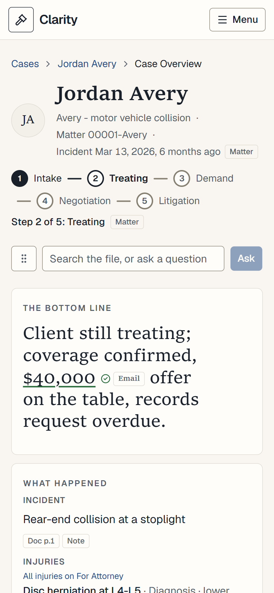

# Clarity

Clarity turns one personal-injury matter in Clio Manage into two views. The firm gets an Overview it can read in 90 seconds: what happened, where the case is now, the figures that matter, the key events in order, what changed since the last visit, and the brief's account in sentences. The medical providers treating the client on lien get a private link that shows only what the attorney releases: where the case stands, whether coverage is confirmed and, if the attorney allows, the defendant's liability limits, what the firm needs from them, and their own bills and records. Every date, amount and claim on screen opens the note, email or PDF page it came from, with the cited quote set above the record, and also highlighted in a note's or email's text. Three tools sit on the same fact store: a draft checker that tests each amount and date in a message to a provider against the file, says when a date is in the file but not on that provider's link, and locks a sentence that would disclose an internal figure; a Calls view that lists who to call next and turns a call's transcript into notes, each citing the words it came from; and Ask, where the firm points at a row, tile or step and asks about it, and every sentence of the answer cites records it was given, checked in code. Clio is read with GET requests only, and nothing is ever written back. Models run when the matter is digested, when the firm asks for a call's notes, and when someone asks a question. They never run when a page loads, and each result is stored and reused.

Built for the Swans Applied AI Hackathon (Law-Di-Gras, San Diego, October 2, 2026), then finished in a trial run by a team of agents (see [The trial](#the-trial)).

| Case Overview, the first screen | The Overview, one scroll down |
|---|---|
| ![Case Overview at 1440 by 900: the header with the client's name, the case line with the incident date and its chip, and the five-step stage track at Step 2 of 5; the one-line Ask bar; then each block on a card of its own: the bottom line, its offer figure checked with its chip; What happened, with the incident, two injuries and liability, each line's chips in the margin; Deadlines and follow-ups, with an overdue task, the statute, the last client contact and the to-do counts; and the four Money tiles at the fold](docs/screenshots/overview.png) |  |
| **The source drawer** | **For Attorney** |
|  |  |
| **For Service Provider (the firm's preview)** | **The provider's own page, from a new link** |
|  |  |
| **The draft checker, in the share composer** | **Calls: the consent step** |
|  |  |
| **Documents** | **The Overview at phone width** |
|  |  |
| **Ask, an answered question** | **Ask, the same thread closed** |
|  |  |

All twelve screenshots show the invented matter that `cli seed-dev` loads, never the real one: a screenshot of the real matter would commit a real person's medical details (D33).
- **The first ten** were retaken by the lead on 2026-10-09, after D54, from a separate server that holds only the invented matter. The provider page comes from a link made for it then. The reviewer opened each one and wrote its caption from what it shows.
  - The Overview's two screens, the source drawer and Documents are 1440×900 at 1.5× pixel density.
  - For Attorney, the firm's preview and the provider page are full pages, 1440 wide.
  - Calls and the draft checker are 1440×1000; the Overview at phone width is 390 wide at 2×.
- **The two Ask screenshots** were taken by the lead on 2026-10-09 after D52, and committed in `69285d3`. The answer is a real one: one question to `claude-sonnet-5-5` on the invented matter, $0.017, never a seeded answer (D52). The reviewer read that server's `GET /api/ops/cost` (1 chat call, 17,398 micro-dollars) and the thread through its GET routes, which call no model.
  - They were taken under chat prompt version 1, before D53's version 2. In two of the five sentences, the answer calls a total "code-computed" and reports Clarity's low-confidence reading of a charge as something the file marks (critic, Pass 7). Version 2 tells the model to write neither, so these two show the old wording.

## Run it

You need Python 3.11 or later, Node 20 or later, and Git. Clarity runs on localhost: the API on port 8000, the web app on port 5173.

### Without Clio: the invented matter

This is the path a clean clone takes. It needs no Clio account and no model key.

**macOS or Linux**

```bash
git clone --branch kit-trial https://github.com/aokhader/Clarity.git && cd Clarity
cp .env.example .env

cd backend
python3 -m venv .venv
source .venv/bin/activate
pip install -r requirements.txt
python -m app.cli seed-dev        # loads the invented matter as matter 1
uvicorn app.main:app --port 8000  # leave running; use a second terminal for the rest
```

```bash
cd Clarity/frontend
npm install
npm run dev                       # http://localhost:5173, forwards /api to port 8000
```

**Windows (PowerShell)**

```powershell
git clone --branch kit-trial https://github.com/aokhader/Clarity.git; cd Clarity
Copy-Item .env.example .env

cd backend
python -m venv .venv
.venv\Scripts\Activate.ps1        # in Git Bash: source .venv/Scripts/activate
pip install -r requirements.txt
python -m app.cli seed-dev
uvicorn app.main:app --port 8000
```

```powershell
cd Clarity\frontend
npm install
npm run dev
```

If PowerShell refuses to run `Activate.ps1`, skip activation and call the environment's Python directly, such as `.venv\Scripts\python -m pip install -r requirements.txt`.

Open `http://localhost:5173/`. It lists the matters; the invented one is at `/matters/1`. The views are in the left rail; in a window narrower than 1024 px, the rail folds into a top bar and the views are under **Menu**. To make a provider link, open **For Attorney** and use **Share** in the Providers panel. The link opens at `/p/<token>`.

**Measured on a clean clone** of commit `189e7ec` on Windows 11 (Git Bash), with Python 3.14.8 and Node 22.23.1, on 2026-10-07.
- PowerShell was used only to check that `Activate.ps1` works.
- pip and npm had packages cached from earlier installs on that machine, so a first install elsewhere will take longer.
- The clone came from a local disk, not GitHub.
- The macOS and Linux commands were not run.

| Step | Time |
|---|---|
| `python -m venv .venv` | 12.9 s |
| `pip install -r requirements.txt` | 37.0 s |
| `python -m app.cli seed-dev` | 2.5 s |
| `npm install` | 21.8 s |
| `npm run dev`, until Vite is ready | 1.3 s |
| The steps above together, until the page is served | about 76 s |
| `pytest -q` (341 passed) | 63.4 s |
| `bash scripts/check.sh` | 67.9 s |

On the invented matter, with no model configured, each matter route called in the clean clone answered in under 35 ms: the header, brief, feed, actions, providers, injuries, timeline, changes, shares, calls and a fact's source. `npm install` reports 7 high-severity advisories, all in the dependency tree of the `shadcn` package; see [Half-done or stubbed](#half-done-or-stubbed).

### With Clio: a real matter

Fill `.env` at the repository root. Every setting, with its default, is in `backend/app/config.py`.

- **Clio:** a developer application with read permissions (`CLIO_CLIENT_ID`, `CLIO_CLIENT_SECRET`). Register `http://127.0.0.1:8000/oauth/callback` as its redirect URI. `CLIO_MATTER_QUERY` is the search string that finds the matter.
- **Models:**
  - `LLM_PROVIDER` is `anthropic`, `openai` or `gemini`. The trial's runs used `anthropic`, with `claude-haiku-5-5` for extraction and `claude-sonnet-5-5` for the merge (D36). The October 2 digest used `claude-sonnet-5-5` and `claude-opus-5-5`.
  - `LLM_API_KEY`, `EXTRACT_MODEL` (vision-capable, one call per page or record) and `MERGE_MODEL` (mapping, significance and the brief).
  - The four `*_PRICE_*` settings, in USD per million tokens, so the cost can be computed.
  - `EXTRACT_RPM` and `MERGE_RPM` cap and space the requests per minute to each model (D31). `LLM_MAX_RETRY_WAIT_SECONDS` fails a call at once when the API asks for a longer wait; retry it later.
- **Ask, the chatbot (D49):** its own settings, on the same `LLM_API_KEY`. Ask stays off, and says what to set, until `CHAT_MODEL`, `CHAT_PRICE_IN` and `CHAT_PRICE_OUT` are filled. D49 chose `claude-sonnet-5-5`, at effort medium. The rest have defaults in `.env.example`:
  - `CHAT_FALLBACK_PRICE_IN`, `CHAT_FALLBACK_PRICE_OUT`, `CHAT_MAX_OUTPUT_TOKENS`, `CHAT_EFFORT`, `CHAT_RPM`;
  - `CHAT_DAILY_BUDGET_USD`, the cap per matter per day;
  - `CHAT_CONTEXT_FACTS`, `CHAT_ITEM_FACTS`, `CHAT_CONTEXT_PAGES`, `CHAT_PAGE_CHARS` and `CHAT_HISTORY_TURNS`, how much of the file one question sends.

Then, from `backend/` with the environment active:

```bash
python -m app.cli auth      # once: prints Clio's sign-in URL and waits for the redirect
python -m app.cli sync      # pulls the matter's records and documents (GET only)
python -m app.cli digest    # pages -> facts -> brief; each model result is stored and reused
uvicorn app.main:app --port 8000
```

- **Auth** listens on port 8000 for Clio's redirect, so stop the API server first. `auth --manual` lets you paste the redirect URL instead.
- **The one non-GET request** this project sends to Clio is OAuth's token exchange, which touches no case data.
- **Other commands:**
  - `cli digest --retry-failed` retries model calls that failed.
  - `cli digest --pages-only` renders pages without calling a model.
  - `cli reextract --dry-run` prices a re-read of chosen pages before running it. `--keep-brief` re-reads them and scores their new facts but leaves the stored brief for the next digest to write.
  - `cli upgrade-schema`, with the API stopped, backs up `data/app.db` to `data/backups/app-<time>-pre-upgrade.db` and checks the copy's integrity. It then rebuilds any table whose constraint lacks a new fact kind or source type, or says "Nothing to upgrade". `seed-dev` runs the upgrade itself.
  - `cli reset` deletes the database and every downloaded file. It refuses while `data/` holds backups; see Tooling, under Known issues.

Without credentials, each command stops with a message, as seen in the clean clone:
- `auth` names the missing `CLIO_CLIENT_ID` and `CLIO_CLIENT_SECRET`.
- `sync` says "No Clio token stored".
- `digest` builds the facts that need no model, then says "Set EXTRACT_MODEL and MERGE_MODEL in .env".

### Checks

`bash scripts/check.sh`, from the repository root (Git Bash on Windows), runs what a screener would:
- ruff
- the Clio client's GET-only tests
- a scan for case data
- a scan for private files
- the backend tests
- the strict TypeScript check
- any other Node tests under `tests/`. There are none, so this step always reports SKIPPED.

Each step prints ok, FAIL or SKIPPED, and SKIPPED means the step verified nothing. The case-data step derives its forbidden terms from the synced matter in `data/app.db`. On a clone holding only the invented matter, it reports SKIPPED and says why.

## What works

### The views

The firm side has six views in the rail: Case Overview, For Attorney, For Service Provider (the firm's preview of a provider's link), Documents, Calls and Ask. Every view but Ask carries the Ask bar above it (see [Ask](#ask-point-at-something-and-ask-d49-to-d54)). The reviewer re-read this section against the code under `frontend/src/components/` and `frontend/src/pages/firm/` at `d8cc936`. That is after the Overview pass (D38, D39), the fixes from the critic's fourth pass (D40), the court events (D41 to D43), the reading and layout fixes of D44 to D48, and the chatbot (D49, D50). The reviewer re-read the Ask section at `69285d3`, for D52, the parts D53 changed at `b64b83e`, and D54's at `5c501fe`. What has been seen running is under [Verified](#verified) and [Built, lightly tested](#built-lightly-tested).

**On every view, the identity header:**
- a breadcrumb (Cases, the client, the view);
- the client's photo from Clio, or initials, and the client's name;
- a case line: Clio's description, the matter number, and the incident date with its age and a source chip;
- the stage on a five-step track, "Step N of 5" in words, an "inferred" marker when the stage was inferred, and its chips. The steps before the current one are filled but carry no check mark and are not called completed, since a case in litigation can still be treating (D40). Only a settled or closed case completes the track.
  - **The stage carries a date only when Clio shows it moved (D53).** The stage fact is dated by Clio's `matter_stage_updated_at` only when that time is later than the matter's `created_at`. Clio stamps both when the record is made, so equal times mark the record's import, not a stage move, and the stage is left undated. The record's last edit (`updated_at`) is never used. The stage chip opens the matter's fields, which list "Stage last changed in Clio" with the day of Clio's stage time, so a dated stage shows its date in its drawer (rule 3).

**Case Overview**, the 90-second read, from top to bottom, each block on a card of its own (D46):
1. **The bottom line:** the brief's headline, with its facts cited.
2. **What happened:** a missing line reads "Not found in file".
   - **Incident:** the account most records give, never Clio's date field (`incident_account`, D39).
   - **Injuries:** one row per body region, up to three, the region the most records state first. Each row shows the finding the most records give for that region; a tie goes to the treating providers. No injury count is shown, since the records restate one injury many times; a link opens all of them on For Attorney (D40).
   - **Liability:** the two most significant liability facts, so a contested point does not read as settled by one opinion (D40).
3. **Deadlines and follow-ups** (called Now before D47): in each cell, the value and its chip.
   - **Next step,** headed "Overdue" when the item it picks is overdue.
   - **Statute,** with its countdown in words. When the Clio task the statute was read from is complete, it reads "Met", with its date in neutral ink, never a red "passed" (D40).
   - **Last client contact.**
   - **To do:** the overdue, upcoming and open-request counts, which link to the action board. "Open requests" replaced "waiting on others", because a record request does not say who is waiting on whom (D40).
4. **Money:** the four tiles, Case value, Coverage limit, Medical specials and Firm spend. They moved here from For Attorney (D38).
5. **The story so far:** about ten key events from `GET /api/matters/{id}/key-events`, each with its date and lane. The API returns them oldest first; the page shows them newest first, numbered down, so the incident stays 1 (D47). Court events have their own kind, `litigation_event`: filed, served, answered, dismissed, renewed, a motion, an order, a hearing, a deposition, a trial, or other. Each is dated by its filing, service or decision date, never by the date of the note that reports it, and is internal (D41, D43). Up to three dated court events are pinned after the incident, chosen by type before score: filed, dismissed, renewed and answered first, then the rest (D43). The other kinds fill the remaining rows. Under the story, one line names the court events no record dates, each by its type word with its chips ("Also in the file, without a date: ...", from `GET /api/matters/{id}/key-events/undated`). It leaves out any that a dated record of another kind states, and is absent when there are none. Deadlines are left out, since a scheduled date does not say that anything happened (D40). "Full timeline" opens For Attorney with the timeline chosen.
6. **Since you last opened:** at most five changes, then a count of the rest. Hidden when nothing is new; one line on a first visit.
7. **Where it stands:** the brief's sentences, one per row, then "Not answered by the file", the brief's open questions. When the case is in litigation, one sentence says where the suit stands: any defense pleaded, and any earlier dismissal or refiling the facts record, citing them (brief prompt version 5, D43).

In What happened, The story so far and Where it stands, each line's source chips sit in a right-hand margin beside it, so the sentence reads uninterrupted and keeps its own chips (D3). A figure the draft checker marks keeps its chip inline. For the incident account and each key event, the extra chips cite the other records that restate it, one chip per record, never one per page (D40). On every view, an item with more sources than it draws ends in "+N more", which opens the source drawer at the first source not drawn; the drawer then steps through all of the item's sources with Previous, Next and "Source N of M" (D46, D47).

**For Attorney:**
- the action board as a table: task, due date, owner and status, overdue first, with each task's title opening its source;
- What matters: the top 10 facts by significance, or the full timeline. The choice is in the URL (`?view=attorney&feed=timeline`);
- injuries, and providers with **Share**.

**Documents:** every source the facts cite, once each, grouped by record type, with a filter for each type and its count. Each row gives the earliest date among its facts, or "Undated", and lists the facts it holds; each fact opens the source in the drawer.

**Accessibility (D38).** What the lead measured is under [Verified](#verified); that was before the Ask bar and the Ask view existed. Built, and read from the code:
- every view reflows to 320 CSS px, and below 1024 px the rail becomes a top bar with a Menu button;
- a skip link to the matter;
- closing the source drawer returns focus to the chip that opened it;
- under each scanned page in the drawer, a "Page text" disclosure holds the page's text as its text alternative.

#### Ask: point at something and ask (D49 to D54)

Firm-only. No route under `/api/p` reaches a thread, a turn or the search, and the provider's own page renders no handle, bar or panel. The design and the rules are in `docs/chat-contract.md`.

- **The Ask bar,** above every firm view but Ask: a grip handle, a search box and Ask, on one line at rest (D50). Items attached to the question, and their starter questions, take a second line only while there are any.
  - **Search** lists the records that match as you type (`GET /api/matters/{id}/search`), with no model call. Choosing a hit attaches it.
  - **Pointing:** drag the grip handle onto any row, tile or stage step, and that item's records are attached. Or click the handle (or press Enter on it) to start pick mode: every target is outlined, and the next one clicked, or reached with Tab and chosen with Enter, is attached. Pick mode is the single-pointer and keyboard path that WCAG 2.5.7 asks for.
  - **Starter questions:** two or three per kind of item (a bill, a deadline, an event, an injury, a money tile, a provider, a call, a document, the stage, any other fact). They are generic and written in code; the item, sent as ids, is what makes the question about this case. The server resolves each item inside the matter and labels it itself.
- **The thread** opens in a side panel that is not a dialog, so the page stays usable beside it, and a chip in it opens the source drawer. **The Ask view** (`?view=ask`) lists the matter's threads in two groups, Open (latest activity first) and Closed (latest closed first), and shows the chosen one at full width. Threads are kept per matter for the whole firm.
- **The answer:** asking starts one model call in the background, and the page polls until the whole answer is ready. In code, before it is stored:
  - every sentence must cite fact ids the model was shown, and a sentence citing any other id is dropped;
  - a sentence with no citation is dropped, unless it only says that the file does not answer, and such a sentence may state no amount or date.
- **When a turn is served,** with no model call:
  - a sentence citing a fact that can no longer be shown is withdrawn, and counted;
  - each sentence's amounts and dates are checked against today's file, as the brief's are (D12), so an answer given before a correction says so. Since D53, a cited fact also states its own record's date: a note's, an email's, a calendar entry's, a ledger entry's or a call's date, or a document's own date in Clio (never its upload). A sentence giving that date is supported by that fact's chip, and a cited record of that day is not taken for a record "dated otherwise" (`backend/app/services/brief_check.py`, for the brief and for Ask);
  - a sentence's chips are the facts the model cited, in its order. A figure other records state keeps its `supported` verdict but adds no chips (D51, undoing D50 (3), whose added chips opened records sharing only a date or an amount with the sentence).
- **Closing a thread (D52)** keeps it as a record. "Archive" is gone.
  - An open thread's row has **Close**, which asks once in place: "Close this thread? It keeps a transcript and takes no more questions." It calls `POST /api/matters/{id}/chat/threads/{tid}/close`, which replaced `.../archive` and refuses with 409 while a turn is still being answered.
  - **Closing freezes the thread** in a table of its own, `chat_transcripts`: its turns exactly as served at that moment, with their verdicts, chips and withdrawn counts, and a plain-text transcript. A closed thread is served from that copy, never checked again against a later file.
  - **A closed thread is read-only,** in the Ask view and in the side panel: no follow-up box and no Retry, and a question or retry sent to it anyway is refused with 409. In their place it says who closed it and when, with **Download transcript** and **New question**.
  - **Download transcript** serves `GET /api/matters/{id}/chat/threads/{tid}/transcript` as text, `clarity-thread-{tid}.txt`. It names the matter by its number, the thread, and who closed it and when. Then, for each question: who asked and when, the items pointed at, each answer sentence followed by its sources by name and page, with "(low confidence)" after a source whose chip is drawn dashed on screen (D53), any verdict other than supported or unchecked (with the file's own figure where it differs), the withdrawn count, and the cost. Code writes it when the thread closes, with no model call (`backend/app/services/chat_transcript.py`). The file name carries no case data.
  - **A closed thread's chips open what was cited then (D54).** A chip names a fact by its id, and a re-read replaces a record's facts with new ids, so before D54 a closed thread's chip could open nothing, or another fact that took the same id (critic, Pass 7, finding 3).
    - **At close,** in the same transaction, Clarity stores a copy of the source behind every chip the frozen turns draw: each sentence's chips, the chips of its figure marks, and each attached item's. The copy is the drawer's answer for that fact at that moment, with the source's pages cut to the cited page (all of them when the fact has none). It goes in a table of its own, `chat_frozen_sources`, one row per thread and fact (`backend/app/services/chat_frozen.py`).
    - **The route:** `GET /api/matters/{id}/chat/threads/{tid}/facts/{fact_id}/source` serves that copy. It answers 404 unless the thread is closed, is in the matter, and cites the fact.
    - **In the browser,** a chip in a closed thread, in the Ask view or the side panel, opens the drawer with `&frozen={tid}` beside `?fact=`. The drawer then reads the frozen route instead of `GET /api/facts/{id}/source`, and says above the source: "As cited when this thread was closed." Stepping through "+N more" keeps `frozen`, and closing the drawer drops it.
    - **A thread closed before D54** has no copies. Each is made the first time its chip is opened, if the cited id still names a fact of that matter, on the same kind of record and the same page. Otherwise the route answers 404 and the drawer says "This source is no longer in the file."
    - **Page images are not frozen.** The copy holds the page's text, but its image still loads from the live file (see [Half-done or stubbed](#half-done-or-stubbed)).
- **Spend:** a cap of `CHAT_DAILY_BUDGET_USD` a day per matter, $2 by default, from local midnight. Past it, Ask answers 429 and stores nothing. With no chat model set, the bar says what to set, and a question asked anyway is stored as "no model", with a retry.

### Verified

Seen working on the hackathon's matter, and by whom.

- **The stage date (D52, then D53), on the real matter on 2026-10-09.**
  - **What was wrong.** The stage fact had been dated by the Clio matter record's last edit of any kind, and an answer in Ask gave that as the day the case changed stage (critic, Pass 6). D52 dated it by Clio's `matter_stage_updated_at` instead (`728dcc4`), after a re-sync and a digest that made no paid call. The date on screen did not move. The critic's Pass 7 then found why: on this matter Clio's stage time, last edit and creation time are equal to the second. Clio set the stage when the record was created, at the import, so the date marked the import and still read as the day the case reached its stage: on the full timeline, and in two answers in Ask.
  - **The fix (D53, `4ea0a6e`, `808c407`).** The stage is dated only when Clio's stage time is later than the record's creation (described under [The views](#the-views)), and the matter's drawer lists "Stage last changed in Clio". On this matter that field gives the day of the import, since Clio's stage time equals the creation time (critic, Pass 7). The label is true, but it does not say that the day is the record's creation. Tests: `backend/tests/test_pipeline_stage_date.py` and `test_source_sections.py`.
  - **The run, by pipeline:** one digest, with a backup first. It made 2 paid calls to `claude-sonnet-5-5`, $0.078 against an estimate of $0.080, with no error, and rewrote the brief. Pipeline reports the money tiles' values unchanged.
  - **Seen by the reviewer through the API, read-only, on 2026-10-09 at `b64b83e`:**
    - the stage fact (a new id) has no date, and sits among the 624 undated rows of the 1,813-row timeline, no longer near its top;
    - its drawer lists "Stage last changed in Clio";
    - the old stage fact's id returns 404, so the two Ask sentences that gave the import day as the stage's date, both citing it, are withdrawn when served: one each in the second and third answers;
    - the brief was rewritten (its `generated_at` is the run's time): 4 sentences, each citing facts, 3 `supported` and one `unchecked`, and a headline citing 5 facts, `supported`;
    - `GET /api/ops/cost` reads 2 more model calls and 3 more cache hits than before the run, with 25,824 more input and 2,659 more output tokens, which is $0.078 at Sonnet's prices.
  - The reviewer did not compare the money tiles before and after; that is pipeline's report.
- **The Overview pass (D38 to D40), measured by the lead on the real matter in Chrome on 2026-10-08:**
  - **The 90-second test, re-counted after D40 at 1440×900: 9 of the 12 questions** in `docs/ui.md` are answered on the first screen, above the fold at 900 px, against a target of at least 9.
    - Not on the first screen: whether the client is still treating, what changed lately, and what has happened so far in order.
    - The last two are answered within one scroll. That makes 11 of 12 within one scroll, short of the target of all 12.
    - Before D40 the lead counted 10. The tenth, whether the client is still treating, came only from the stage track's check mark. The critic found that the mark said treatment was complete when it was not (Pass 4, finding 4), and D40 removed it.
    - The count was not re-run after D44 to D50. With the Ask bar at rest above the Overview, the lead reports that the first screen still shows the bottom line, what happened and the deadlines (H6, D50).
  - **Lighthouse's accessibility score, re-run after the Overview pass, is 100** on all five firm views of the time and on the provider page at `/p/:token`. No run on the Ask bar or the Ask view is recorded.
  - **Reflow** at 640 and 320 CSS px, after D38. The top bar overflowed at 320 px until `724c6e3` fixed it.
  - **The D40 fixes were in place for the re-count** (`fe07ba2` to `53523da`, code only, no model call, described under [The views](#the-views)): a met statute reads "Met"; earlier stages are not marked completed; injuries show one row per body region; liability shows two facts; "Overdue" heads the Now cell when its item is overdue; the count reads "open requests"; the story has no deadlines; restating records are counted once each. The lead did not report checking each fix on its own.
  - **Seen by the reviewer on 2026-10-08:**
    - through the API on the real matter, read-only: the story's 10 events include no deadline, and the incident account cites 9 records;
    - in the lead's screenshots of the invented matter, then and again in the set of 2026-10-09: earlier stages filled with no check mark, "Overdue" heading the next-step cell, and "1 open request".
  - Backend tests cover the key events and the incident account (`backend/tests/test_backend_key_events.py`, `test_backend_incident_account.py`). The reviewer has read the code and seen the lead's screenshots of the invented matter, not the real matter's screens.
- **The critic's fourth pass (C4, `docs/reviews/critic.md`), on the real matter on 2026-10-08:** through the API and the code at `e61aee2`, with no browser, and the database opened read-only.
  - It traced every block of the new Overview to its sources. Every chip it opened holds its text.
  - The incident account is a model fact, never the Clio field, and the money row agrees with the brief's figures.
  - Its first-screen findings were fixed in code under D40 (see the Overview pass entry above). What D40 left open is under Known issues.
- **Court events in the story (D41), on the real matter on 2026-10-08:**
  - **By the lead, through the API and the page:**
    - the story shows three court rows: the earlier suit, the summons and complaint, and the answer;
    - each is internal and opens its page;
    - the answer's quote is in its page's text, and the two scanned pages passed their second read.
  - **By the reviewer, through the API and the database, read-only:**
    - the story's 10 events include 3 `litigation_event` rows (two `filed`, one `answered`), each dated, internal, verified and cited to a document page;
    - the re-read behind them made 19 paid calls with no error (see [Cost per case](#cost-per-case)).
- **The brief and the story after D42 and D43, on the real matter on 2026-10-08:**
  - **By the lead, through the page:**
    - the brief's third sentence carries the suit, the dismissal and refiling, and the pleaded limitations defense, each cited;
    - every sentence cites facts, and the draft checker's marks (D12) pass;
    - the story holds the first suit, the summons and complaint, and the answer;
    - the line of undated court events reads Filed · Dismissed · Renewed · Served · Court event.
  - **By pipeline:** the money tiles are identical before and after both runs, compared by value and by fact id.
  - **By the reviewer, through the API and the database, read-only:**
    - the brief has 4 sentences, each citing facts and `supported`; the headline cites 3 facts and states no figure (`unchecked`);
    - the story's 10 events include 3 court rows (two `filed`, one `answered`), all dated;
    - the undated list returns 5 internal court events (filed, dismissed, renewed, served, other), none dated.
- **The critic's fifth pass (C5, `docs/reviews/critic.md`), on the real matter on 2026-10-08:** it checked the rewritten brief, the court events and the provider previews. Its findings 1 to 3 were fixed under D43. The minor items of finding 4 remain, under Known issues.
- **By the lead, in the browser, during the trial (2026-10-07):**
  - The brief's sentences, each ending in source chips that open the cited page (U1). That was the October 2 brief; the model runs of 2026-10-08 rewrote it (below). Since D38 the chips sit in the margin beside each sentence.
  - The source drawer, and the share preview's chips, which open their sources (U8).
  - The draft checker:
    - in the composer: the "don't send" lock, and removing a sentence (U4);
    - the brief's "differs from the file" mark (U7).
  - "No bills on file" in place of $0, and the Coverage tile's leading limit with the client's own policies labelled beneath it (U9). That was before the limits were re-read; for the tile since D37, see below.
  - Calls:
    - the list of whom to call, with chips;
    - a typed number;
    - the consent gate;
    - the notes state when no model is configured.
- **After the model runs of 2026-10-08 (D36; costs under [Cost per case](#cost-per-case)):**
  - The lead checked the results in the browser after both runs.
  - The reviewer checked them through the API, with the database opened read-only, at `f37a110`:
    - The brief has 5 sentences, down from 8, and every one cites facts. Its headline cites 4 facts (D14).
    - No sentence or headline figure is marked "differs from the file" or "not in the file". Two sentences state no amount or date, so they are "unchecked".
    - No open question asks for a date the header already shows (P11).
    - The stage label has no trailing space, and the ledger's medical charges carry the neutral title (P12).
    - 19 of the 20 policy limits name their policy (D19). The critic found two of them labelled as the client's when they are another party's (Known issues).
    - Economic damages and recovery caps are kinds of their own (D20), and the Case value and Medical specials tiles cite neither.
    - Each provider's bill facts are unchanged by the runs: the same amounts, sources and pages as in the backup taken before them. So every provider's total is unchanged.
  - The critic's third pass (C3, `docs/reviews/critic.md`) traced the rewritten brief, the Coverage tile, the Case value and Medical specials tiles, all ten provider totals, and each re-read record. Every amount and date in the brief checks out. Its open findings are under Known issues.
- **After the critic's third-pass fixes (D37), seen by the reviewer through the API at `10ffbb3`:**
  - **The Coverage figure** has 7 rows in the API, leads with the defendant's per-person limit, and carries no warning. Since D38 the tile shows the lead and one more limit, with the rest behind a disclosure (`e2142ac`). A limit that names no policy or no per-person or per-occurrence basis is folded into the row whose figure it repeats. Where limits genuinely conflict, the tile keeps its lead and adds "Sources disagree on some limits" beneath it (read from `KpiTile.tsx`; the invented matter's two defendant figures raise the flag).
  - **A provider's coverage limits:** with every setting on, an unsaved preview for one provider released only the defendant's liability limits. That was 10 facts, shown on the page as two labelled limits, per person and per occurrence. The client's own policies stay with the firm.
  - **The draft checker** answers `not_on_link`, "In the file, not on this link", for the incident date in a draft to a provider whose link does not carry it. An invented date is still `not_in_file`.
- **After the re-sync of 2026-10-07 (D30), seen by the reviewer through the API on 2026-10-08:**
  - The sync fetched again the one pleading whose download had failed on October 2, and the next digest rendered it. All 27 of its page images now load.
  - All 31 documents carry Clio's received date, which the source drawer shows as the document's own date.
- **By the lead, outside the browser:**
  - The draft checker's server side on the real matter (B1).
  - The in-place schema upgrade on the real database, with all 14 tables keeping their row counts (D24).
- **By the critic, through the API with the database opened read-only, in two passes** (at commits `9c05e39` and `c18388b`; `docs/reviews/critic.md`):
  - All ten providers were previewed with every setting on, and no internal or strategy-flagged fact reached a payload.
  - The firm view's update text for all ten providers came back supported from the draft checker, with no false lock.
  - The provider routes are three GETs.
  - No GET request reaches a model. Every firm route answered in 0.2 to 0.35 s with no model configured.

### Seen working in a clean clone

By the reviewer, on the invented matter, on 2026-10-07:
- The steps under [Without Clio](#without-clio-the-invented-matter), in Git Bash on Windows, and `sync` and `digest` with no credentials.
- `pytest`: 341 passed at `189e7ec`. In the main checkout, 560 pass at `5c501fe`, through `check.sh` on 2026-10-09.
- `check.sh`: no step failed after `e22a5ae`. Before that commit, the case-data step failed falsely on the invented matter's own fixture.
- **After the Overview pass, on 2026-10-08:** the clone was pulled to the branch's head, not cloned afresh, and `cli seed-dev` reloaded the invented matter.
  - At `389927b`, every route the Overview calls answered 200 in under 20 ms: the header, the brief, key events, injuries, actions, the liability and deadline timelines, and the changes.
  - At `1707584`, after the fixture gained records that give an incident account (`0deb4a1`), the header's `incident_account` carries its text and one record restating it. `key-events` returned 10 events, oldest first, with that account's fact first.
  - At `889debf`, after D41, `seed-dev` first failed on the old schema, then passed after `upgrade_schema`. Since `5fb132f`, `seed-dev` upgrades its database itself. The story's 10 events then included the invented matter's court event. Both providers' previews listed one update, "Moved to treatment".
  - At `827f2d2`, after D42 and D43, `seed-dev` passed on the clone's existing database in about 4 s. The matter's routes answered 200: the header, the brief, key events and the undated list, actions, the feed, the timeline, injuries, providers, shares, calls, and the changes once a stub user was chosen. A fact's source and the page images were not called; the lead's drawer screenshot of that day showed both. `key-events` returned 10 events, oldest first, each with a source, the court event among them. `key-events/undated` returned none, because the invented matter's one court event is dated, so the line under the story is absent there. The clone's TypeScript check passed. The lead took four screenshots from this clone that day; the set of 2026-10-09 replaced them.
- Sharing:
  - A created link returns exactly what the preview showed.
  - A withdrawn link returns 410.
  - Five deliberate breaks of the provider filter in `services/visibility.py` were tried: the expiry and withdrawal check, another provider's bills, hidden items, strategy flags, and the shareable tag. Each one made the visibility and share tests fail.
- The draft checker:
  - A sentence restating a provider's own bill total is `supported`.
  - A figure held only in an internal note is `do_not_send`, with "Kept internal: never shared with providers" and a chip to that note.
  - An unknown date is `not_in_file`.
  - The server refuses a share whose note holds the internal figure (422) and accepts one that does not (201).
- After D35's backend change (`01d6e41`), a live link served each item in its bills list as a bill or a lien.

By the lead, in the browser, on the invented matter:
- **On 2026-10-09, after D54:** the ten screenshots above other than Ask's, retaken from a separate server that holds only the invented matter; the reviewer read its `GET /api/matters`, which lists that one matter. The reviewer opened each image and checked it against its caption. Across them:
  - the one-line Ask bar is on the Overview, For Attorney, the firm's preview, Documents and Calls, and at phone width; the provider's own page has none;
  - each Overview block is on a card of its own, and the deadlines block is titled "Deadlines and follow-ups";
  - the story is marked "newest first" and numbered down from 10, so the incident is 1;
  - the drawer sets the cited passage in a callout headed by its page, above "Page 2 of 2" with Previous and Next;
  - Calls shows the consent dialog, "Ask before transcribing";
  - the provider page, from a link made then for the orthopedic office, lists its lien labelled "Lien" under "Bills and liens", and its total counts the one bill.
- **On 2026-10-07 and 2026-10-08,** the earlier sets came from the reviewer's clean clone (`d62208c` to `af595b2`), and the reviewer checked each against its captions then. On 2026-10-08 the lead measured no horizontal scroll on the Overview at 390 CSS px (a scroll width of 390 px). The set of 2026-10-09 replaced them.
- **While taking the earlier set, on 2026-10-07,** the freeze fixes `b71b281`, `1b5c369` and `cfc121b` (D35):
  - the Case value range fits its tile, breaking after its dash;
  - on the provider page and the firm's preview, the list reads "Bills and liens", with a caption that liens are not added to the total;
  - each lien row is labelled "Lien", with its amount set apart from the bills;
  - and, in that set's other shots, the brief's chips, the consent step, and the draft checker's lock in the share composer.

### Built, lightly tested

Unit tests pass. None of these has been seen in the browser on the real matter since it was last changed, except where an entry says so.

- **Ask, the chatbot (D49 to D54).** Tests: `backend/tests/test_chat_api.py`, `test_backend_chat_view.py`, `test_pipeline_chat.py` and `test_chat_frozen_sources_api.py`, 62 tests among the backend's 560, all passing at `5c501fe` through `check.sh`.
  - **Three answers on the real matter so far,** all on 2026-10-09, all under chat prompt version 1; none has been asked under version 2. The reviewer read them through the API's GET routes, which call no model, last after D53's digest:
    - the first, with a money tile attached, before the D50 trim: 6 sentences, each citing facts; 5 state figures, all `supported`, and one states none (`unchecked`); none withdrawn;
    - the second, with the stage attached, after the trim: of 3 sentences, one is withdrawn. It gave the import day as the day the case reached its stage, and cited the stage fact that D53's digest replaced. The 2 served sentences cite facts: one `supported` and one `unchecked`;
    - the third, a follow-up in the second thread with no item attached, asked at 12:03 PDT: of 3 sentences, one is withdrawn, for the same reason as the second answer's. Before D53, a second sentence was marked "not in the file" for a date that its cited note carries as its own date (critic, Pass 7, finding 2). Under D53's check it is `supported`, with no model call, as are its amount and the first sentence.
  - **Closing a thread (D52):**
    - **By the reviewer, on 2026-10-09, on the invented matter of the lead's screenshots,** through GET routes only: the thread list holds the one thread with its `closed_at`; the thread names Demo Attorney as who closed it; and the transcript route answered 200 as `text/plain`, with `attachment; filename="clarity-thread-1.txt"`. The file held the matter's number, who closed the thread and when, the question and its item, the five sentences each with its sources by title and page, and the cost.
    - **By the lead, on the invented matter:** a question in a closed thread is refused with 409, and the transcript of a thread in another matter is 404. The two Ask screenshots show the view before and after Close.
    - **By backend, on a copy of the real database:** both threads load, and close and download work. On the real API both threads are still open; the first was archived before D52, and an archived thread froze nothing, so it is served as open until someone closes it.
    - **By ui-builder:** the Close confirmation, the Open and Closed groups, and the read-only thread, in the view and the panel, tested headless with chat mocked. Nobody has reported closing a thread on the real matter in the browser.
    - **The transcript's "(low confidence)" mark (D53)** is covered by a backend test (`test_backend_chat_view.py`). No one has reported seeing it in a downloaded transcript.
  - **A closed thread's frozen sources (D54, backend `71a6467` and `5c501fe`, ui-builder `61213a0`):**
    - **By backend, on copies of the real database:** both of the real matter's threads, closed in the copies only, and all 65 of their chips answered 200 from the frozen route, each cut to the right page. Seven backend tests (`test_chat_frozen_sources_api.py`) cover: a copy per cited source, cut to its page; a re-read that leaves the copy as cited while the live drawer answers 404; an id a re-read gave to another fact; a figure mark's chip; the 404s for an open thread, an uncited fact and another matter; the first-open copy of a thread closed before D54; and its refusal of an id that now names a fact on another page.
    - **By the lead, on the invented matter:** the closed thread's 3 cited facts answered 200 from the frozen route, and an uncited fact and an open thread 404. In the browser, a chip in the closed thread loaded the frozen route, with `frozen=1` in the URL, and the drawer showed "As cited when this thread was closed."
    - **By the reviewer, on 2026-10-09, through GET routes only:**
      - on the invented matter, the closed thread's chips (its sentences', its figure marks' and its item's) cite 3 facts, and each answered 200 from the frozen route in under 10 ms. The document fact's copy holds only its cited page, page 2, where the live drawer serves both of the document's pages. Its image link is the live `/api/pages/{id}/image`, which answered 200. An uncited fact and a thread not in the matter answered 404. That thread was closed before D54, so its copies came from the first-open path, not from a close;
      - on the real matter's API, which serves the new route, both threads are open, and the route answered 404 for one of them ("is open; nothing is frozen").
    - **By ui-builder:** the frozen drawer, its line, and stepping and closing, 14 checks headless with chat mocked.
    - Nobody has closed a thread on the real matter, so no frozen source exists there.
  - **By the lead, in the browser on the real matter, before D50 (H4):**
    - search with Enter attaches an item; pick mode by click attaches one; a drag attaches when the pointer moves;
    - the Ask view renders; at 320 px nothing scrolls sideways;
    - the provider route has no handle and makes no chat request;
    - a page load makes one chat request, the budget GET, and no model call.
  - **On the first answer,** the lead first read one sentence's chip as not holding its total; the critic's Pass 6 found the cited note's subject states it, and its nine lines add up to it. D50 (3) added chips for figures other records state; the critic found those added chips wrong in 3 of 9 sentences, and D51 removed them. Every chip the model chose holds its sentence (critic, Pass 6, `docs/reviews/critic.md`).
  - **After D50:** ui-builder tested the one-line bar headless, with chat mocked, at 36 px tall at rest at 1440 and 320 px wide; the lead measured 36 px at 1440×900 in the browser. The critic's Pass 6 (H5) read both answers chip by chip, with GETs only.

- **The D37 screens:** the types check, and the reviewer has read the code but not seen these rendered.
  - **The brief's chips (`8d4b1fa`):** a sentence draws its document-page chips first, so a scanned page is among the two visible chips whenever the sentence cites one (`frontend/src/components/firm/BriefCitations.tsx`).
  - **The draft-check panel (`f267fc6`):** a `not_on_link` date is shown in a neutral tone with one chip and a count, under "Some dates are in the file but not on this link". It neither locks nor warns.
  - **The share settings:** "Policy limits" now reads "The defendant's liability limits only, per person and per occurrence".
- **Provider updates show stage moves only (D41, `764bd38`):**
  - A provider's "Recent updates" list only moves to a named stage, in labels written in code, such as "Moved to litigation". The status label the model writes never reaches a provider.
  - Before this, the firm's preview of a provider's link on the real matter showed a model-written label that disclosed a past dismissal and renewal. No link existed, so nothing was sent.
  - Tests: `backend/tests/test_backend_provider_updates.py` and `test_visibility.py`. The reviewer saw the clone's preview return "Moved to treatment" for both of the invented matter's providers, through the API, not the page.
- **Liens in the provider update (D35, `612945b`):** the "Send update" draft counts and totals bills only, and lists liens under a heading of their own. On the real matter no lien reaches a provider; see Known issues.

- **Draft-checker matching (D25, D28):**
  - It reads amounts written with k, grand, bucks, USD, a trailing or full-width dollar sign, or in words, plus bare figures of four or more digits.
  - It catches ranges, rounding, and an internal figure split across two amounts.
  - It counts the firm-spend total and call-note figures as internal.
  - A date locks only when it is the date of a sensitive internal fact (an offer, a demand, a settlement, a valuation, a limit) or of a legal deadline. A plain calendar entry does not lock.
- **Fixes since the critic's second pass:**
  - The Case value tile leads with the firm's own valuation.
  - A provider's "last movement" is left out when the latest change has no date.
  - The client's treating injuries are listed first.
  - The consent wording names every service the audio and transcript reach (D27).
- **Pipeline fixes (P2 to P7).** The re-sync and the two model runs on the real matter went through them with no failed item, so their failure paths were not exercised there.
  - A partly failed sync is pulled again (P2).
  - A sync stopped by any error is closed as failed (P3).
  - A failed mapping call keeps the previous mapping (P4).
  - The policy-limit cross-check (P5).
  - A second digest over unchanged inputs calls no model (P6). In run (b), the unchanged mapping calls and one record were answered from the cache.
- **Model access:**
  - The Gemini provider (D30) and its per-model request limit (D31). On the free tier, the trials got no answer in 12 attempts on 2026-10-07 (D34) and 4 answers in 14 attempts on 2026-10-08 (D36). So the runs moved to Anthropic, and no digest of the real matter has run on Gemini.
  - The "Retry failed calls" control (D29), which had not been clicked by the freeze. The runs had no failed call to retry.
- **Call notes from a transcript (C-P):** every note's quote is checked against the transcript. The real matter's database holds no notes made by a live model, and the Manager's test call (C-T) has not happened.

### Half-done or stubbed

From the stubs list in `STATUS.md`, the track files in `docs/tracks/`, `docs/progress.md`, and the critic's open findings.

**Stubs and shortcuts**
- **Firm users:**
  - No real authentication. Three stub users are seeded (Demo Attorney, Demo Paralegal, Demo Case Manager), and the firm view acts as the first, with no login and, since D48, no switcher (`backend/app/services/users.py`, `frontend/src/api/users.ts`). That user dates "since you last opened", and is recorded as who placed a call, made a provider link or asked a question.
  - Each stub user's first "last opened" date is seeded: 21 days ago, 7 days ago, and never (`backend/app/services/users.py`, `backend/app/services/visits.py`).
- **Providers:**
  - Provider access is by an unguessable, expiring link only; there is no provider login.
  - "Send update" leaves the recipient blank, because no synced field holds the provider's email (`frontend/src/components/share/SendUpdateMenu.tsx`).
- **`cli seed-dev`** loads an invented matter for development, tests and the screenshots, including a handwritten brief (`backend/tests/fixtures/synthetic_matter.py`).
- **What the sync and digest leave out:**
  - Clio's personal-injury endpoints (`/medical_records_details.json`, `/damages.json`) are not synced. Bills come from documents, notes and the expense ledger.
  - A Clio request falls back to a smaller field list if Clio rejects a field name.
  - Calendar entries all become deadlines, including treatment appointments. Only legal deadlines lock a draft (D28).
  - Time entries produce no facts, and firm spend counts non-time entries only.
- **The draft checker:**
  - It checks figures only. A sentence that discloses an internal fact without an amount or a date is `unchecked`, and the UI says so (D17).
  - A figure near an internal amount, but not equal to it, rounded to it, or in a range around it, is not flagged.
- **Pipeline:**
  - A sync or digest that fails before its run row exists is held in server memory, so a restart forgets it (`backend/app/services/jobs.py`).
  - A failed model call is not retried until `cli digest --retry-failed` or the footer's retry control (`backend/app/digest/llm.py`).
  - `cli reextract --dry-run` prices a selection from the average recorded cost per call, which is an upper bound (`backend/app/digest/reextract.py`).
  - A date said on a call without a year is placed at the nearest such day within six months, else left out (`backend/app/digest/call_notes.py`).
  - A court event in a note is dated only by a date its text gives, never by the note's own date (`backend/app/digest/prompts/extract_note.txt`). See Known issues.
  - Two notes that hold policy limits behind the Coverage tile were not re-read in D42, so a dismissal one of them reports stays kind `other` (`backend/app/digest/extract.py`).
  - `cli reextract --keep-brief` leaves the stored brief as it was; the next full digest writes it with one merge call (`backend/app/cli.py`).
- **Ask, the chatbot (D49 to D54):**
  - **Search hits show no chip until asked.** A hit in the Ask bar's list shows its title, date and source type as text, since an option in a list box cannot hold a button. Its chips open once the question is asked (`frontend/src/components/ask/AskBar.tsx`).
  - **A drag does not scroll the page at its edges.** The mouse wheel scrolls during a drag, and pick mode reaches any row (`frontend/src/components/ask/AskHandle.tsx`).
  - **Retrieval is by words, not meaning.** It matches the question's words at word starts, plus a fixed list of generic words for kinds of fact. There are no embeddings, so a question in other words falls back to the facts ranked most significant (`backend/app/services/chat_context.py`).
  - **What one question sends is capped:**
    - an attached item resolves to at most 50 facts, most significant first, with restatements added only for the facts pointed at (`backend/app/services/chat_attachments.py`);
    - the model is shown that item's 25 most significant (`CHAT_ITEM_FACTS`, D50; `backend/app/digest/chat.py`);
    - the overview sent with every question holds at most 20 facts, the leading one per money figure, and the brief's cited facts only as room allows (`backend/app/services/chat_context.py`).
  - **The turn's record of what the model saw lists too much.** It stores every fact of an attached item, up to 50, though since D50 the model is shown only 25. Pipeline has suggested the fix in `STATUS.md` (`context_fact_ids` in `backend/app/services/chat_context.py`).
  - **The daily cap is read before a run starts,** so questions asked at the same moment can each pass and overspend it by one answer each (`backend/app/services/chat.py`).
  - **Pricing:**
    - a chat call of which any attempt was answered by the refusal fallback is priced wholly at the fallback's rates, an upper bound;
    - a response that names the chat model plus an 8-digit date counts as the chat model, not the fallback (both `backend/app/digest/llm.py`).
  - **Chat on `openai` or `gemini`** sends its own output limit, but no effort setting and no fallback. Every answer so far came through Anthropic (D49) (`backend/app/digest/llm.py`).
  - **The figure check still passes a date that any record of that day states,** even one the sentence does not cite (critic, Pass 6, finding 4). D53 narrowed this; it did not close it.
    - **What D53 covers:** a date that is a cited fact's own record date, meaning a note's, an email's, a calendar entry's, a ledger entry's or a call's date, or a document's own date in Clio. Such a date now counts as stated by the cited fact, and its chip supports it. Before D53, it was `supported` only through some other record that shared the day, or marked "not in the file" when none did (critic, Pass 7, finding 2).
    - **What is still open:** a date that no cited fact and no cited record holds is still `supported` when any other record in the file states that day. The "not in the cited records" verdict the critic asked for does not exist. A date is held to the sentence's citations only when a cited fact carries a date of its own (`backend/app/services/brief_check.py`). This applies to the brief as well as to Ask.
  - **A closed thread's frozen sources keep the page's text, not its image (D54).** The copy's image link points at today's rendered page (`/api/pages/{id}/image`). A re-sync that brings a new version of the document re-renders that page in place, so the drawer would show the frozen text beside the new image, and a page the new version no longer has shows no image at all (`backend/app/services/chat_frozen.py`, `backend/app/digest/pages.py`). The quote and page text, which the chip's claim rests on, are the copy's.
  - **A thread closed before D54 is frozen on first open, not at close,** so a re-read in between can still reach it (`backend/app/services/chat_frozen.py`).
    - If the cited fact is gone, the chip opens "This source is no longer in the file."
    - The first-open check compares the matter, the kind of record and the page number, not the record itself. A fact on another record of the same kind and page number that took the cited id would be frozen as if it were the one cited. A note or an email has no page number, so for them any other note or email with that id passes.
    - Only threads closed after D52 and before D54 take this path. On the invented matter that is its one closed thread, whose 3 sources were already frozen on first open. The real matter has no closed thread.
  - **A firm-wide chat cap** does not exist; the cap is per matter (critic, Pass 6; left to the Manager).
  - **A Closed row in the list names who asked, not who closed.** The list's summary carries no `closed_by`; ui-builder has asked backend for it in `STATUS.md`. The thread itself names who closed it (`frontend/src/components/ask/ChatThreadRow.tsx`).
  - **The close time lives in D49's `archived_at` column,** since `upgrade_schema` cannot rename a column. A thread archived before D52 froze nothing, so it is served as open until it is closed, as the real matter's first thread is (`backend/app/models.py`).
- **The source drawer** steps through at most 1,000 sources of one item. A longer list stops at the 1,000th, and its count reads 1,000 (`frontend/src/lib/useSourceDrawer.ts`, D47).
- **Page and link details:**
  - The provider page does not show the firm's name; no synced record carries it.
  - A live link cannot be edited. To change what a provider sees, withdraw it and share again.
  - The `requests` setting releases only open record requests and open tasks.
  - The `coverage_limits` setting releases only the defendant's liability limits, never the client's own policies (D37).

**Known issues**

The issues that waited on the re-digest, the re-read and the re-sync are resolved: the brief's unsourced figure, the headline without chips, the open question about a date on the page, the ledger bill's raw title, the missing pleading and the upload dates. Policy limits are now tagged by policy, all but one, though two carry the wrong tag (below). The Coverage tile's false "Sources disagree" after the re-read is fixed too (D37). What was seen is under [Verified](#verified). Since D47, every "+N more" opens the drawer and steps through the item's sources, so the incident account's 9 records, of which the Overview drew 2 and counted the rest (critic Pass 4, finding 10), can all be opened from it; the reviewer read this in the code (`frontend/src/components/shared/SourceChipList.tsx`), not on the page. These remain:

- **Another party's liability policy is labelled "Client's other policy"** (critic Pass 3, finding 2).
  - The defense driver's own auto policy appears on the Coverage tile as two rows of the client's.
  - The policy field (D21) has no value for another party's liability, so the model chose the nearest one. An attorney reading the tile would think the client holds a second policy, and would miss a second source of recovery.
  - The fix is an added value in the contract, a prompt line and a re-read of one record. By the Manager's choice (D37), it is not made now.
  - Providers never see this policy, since a link releases only the defendant's limits (D37).
- **A hidden item on a share comes back after a re-digest that rebuilds its fact** (critic Pass 3, finding 5).
  - A share stores hidden items by fact id (`Share.hidden_fact_ids_json` in `backend/app/models.py`, read in `backend/app/services/visibility.py`). A re-digest that re-reads a record gives its facts new ids. The two model runs replaced 91 facts this way.
  - No share exists on the real matter, so nothing leaked. It is still a gap in rule 4, the provider boundary. Owner: backend, after the freeze.
- **The brief may leave out what the defense medical exams found** (critic Pass 3, finding 6).
  - Since D43 it states the pleaded limitations defense, which Pass 3 found missing. Whether it states the exam findings has not been re-checked since Pass 3.
  - What matters, the ranked feed on For Attorney, shows them.
  - The open questions state their premises without chips.
- **Court events, after the D41 to D43 re-reads:**
  - **A court event is never dated by the note that reports it.** The critic found two notes dated before the events they describe. So about ten court-event facts, by the lead's count, stay undated, among them the dismissal and the renewal. They appear only in the line under the story, which has 5 entries on the real matter.
  - **The undated line may repeat a dated event when the titles differ.** Its matcher is strict on purpose: it keeps a real event rather than risk hiding one.
  - **An event's type can vary between model runs,** for example `other` in one run and `served` in another.
  - **Minor, from the critic's fifth pass (finding 4):**
    - the answer's chip quotes only the document's heading, not the clerk's stamp that holds its filing date;
    - the attorney's verification of the complaint is filed as a court event, though it is a signature;
    - an expert disclosure that was served is typed `other`;
    - the first injury region's row leads with a complaint line rather than the diagnosis, the knees come sixth, and the head and the brain count as two regions;
    - two diagnoses from one page of one defense exam report are two rows of the story.
- **On the Overview, left open by D40** (critic Pass 4):
  - **Nothing within one scroll says whether the client is still treating,** by the lead's re-count after D40 on the real matter. It is the one question of the 90-second test that the Overview misses (see [Verified](#verified)).
  - **The open-request count mixes the firm's requests with demands made of the client.** About half of the 44, by the critic's count, are defense or carrier demands for the client's records, which the firm owes. A record request carries no direction. Adding one needs a prompt line and a re-read of the request records. Finding 7.
  - **Defense medical exams sit in the Treatment lane** of the story, because a diagnosis maps to that lane. Their reports' own dates disagree with a firm note and the calendar, which put the exams about six months later. The chips support what is shown. Finding 10.
- **No full digest has run on the D36 models.** The whole-case cost at those models is an estimate; see [Cost per case](#cost-per-case).
- **Pages read before a provider was known never get that provider.** Two fixes are written up in `STATUS.md`; neither is built.
  - None of the real matter's 8 lien facts has a provider attached, as found during D35 and confirmed in the database.
  - A link's bills-and-liens setting releases only its own provider's facts, so no provider's link shows a lien on the real matter.
- **On the provider page and in the firm's lists:**
  - The "shared on" and "expires" dates are UTC days, so a link made in the evening, Pacific time, reads as made the next day (`backend/app/services/provider_view.py`).
  - A stored call records the consent wording but not which firm user confirmed it.
  - The provider's "File opened" date (from a note) and the header's opened date (from Clio) differ by two days, as of the critic's third pass.
  - The action board's open requests numbered 45, 26 of them undated, as of the critic's second pass.
- **Smaller issues:**
  - Deduplication deletes duplicate facts, so a source that had one gets new fact ids on the next run.
  - A re-sync pulls the matter named by `CLIO_MATTER_QUERY`, not necessarily the one on screen.
  - Each visit uses up the "since you last opened" block.
  - As of the critic's third pass:
    - the Case value tile lists the valuation a second time, as "At least" the same figure, from a fact whose low end alone was filled;
    - the ranked feed lists one treatment recommendation twice;
    - the re-read dropped two caveats that records state and no fact now holds. The critic found nothing lost that an attorney relies on.
  - The stored brief's `generated_at` still reads its first generation on October 2, though the runs rewrote its text on 2026-10-08. `f37a110` dates each later rewrite correctly, but this brief was written before it. The screen does not show this date.
- **Tooling:**
  - `npm install` reports 7 high-severity advisories, all in the dependency tree of `shadcn`, whose stylesheet the app imports. They have not been triaged.
  - On Windows, `uvicorn --reload` sometimes keeps serving old code; restart it if a new route returns 404.
  - The Vite proxy target is fixed at port 8000 (`frontend/vite.config.ts`).
  - **`cli reset` refuses while `data/` holds backups,** whether in `data/backups/` or the `app.db.bak-*` file an upgrade leaves beside the database. Move or delete them first. This is on purpose, so a reset cannot wipe the backups of a real file. In the reviewer's clone it refused, naming both, and deleted nothing.
  - **A database made before a new fact kind or source type refuses it** ("CHECK constraint failed") until `cli upgrade-schema` runs (see [With Clio](#with-clio-a-real-matter)). In the reviewer's clone, the command backed up the database, found the copy intact, and reported "Nothing to upgrade".

## Cost per case

Measured with `GET /api/ops/cost` and the `llm_calls` table, on the hackathon's matter. Every call is costed at the prices set in `.env` when it ran.

**One full digest, measured on October 2, 2026:**

| | Model | Calls | Cost |
|---|---|---|---|
| Extraction: one call per page or record (361 pages in 31 documents, 112 records) | `claude-sonnet-5-5` | 473 | $5.86 |
| Merge: field and role mapping, significance, the brief | `claude-opus-5-5` | 41 | $1.79 |
| **One full digest** | | **514** | **$7.65** |

That is 1,728,515 input and 329,989 output tokens. Another 184 calls were rejected by the API (HTTP 400 or 401), and they used no tokens and cost nothing.
- **Reopening the matter costs nothing,** because no page load calls a model. The one chat request a page load makes is `GET .../chat/budget`, which reads the day's spend from `llm_calls`.
- **A second digest over unchanged inputs makes no model call,** because results are cached by input hash (`backend/tests/test_pipeline_second_digest.py`).

**The trial's model runs, measured on 2026-10-08 (D36, D41 to D43).** These ran on Anthropic's paid tier:
- extraction on `claude-haiku-5-5`, at $0.10 per million input tokens and $0.50 per million output tokens;
- the merge on `claude-sonnet-5-5`, at $2 and $10.

They re-ran only the calls whose prompts or inputs had changed, so they price an update, not a whole case. Run (a) re-digested the matter. Run (b) re-read 9 named records under the new extraction prompt (P13). Run (c) re-read 13 pleading pages under the court-event prompt with `cli reextract --keep-brief`, so the stored brief was kept (P14, D41). Run (d) re-read 14 notes and emails about court events under a prompt of their own for notes, then rewrote the brief (P15, D42). Run (e) re-read one complaint page and rewrote the brief under brief prompt version 5 (P16, D43).

| Run | Purpose | Model | Tokens in / out | Cost |
|---|---|---|---|---|
| (a) | Role mapping | `claude-sonnet-5-5` | 1,785 / 368 | $0.0073 |
| (a) | Field mapping | `claude-sonnet-5-5` | 2,311 / 378 | $0.0084 |
| (a) | Ledger classification | `claude-sonnet-5-5` | 3,742 / 737 | $0.0149 |
| (a) | The matter's record | `claude-haiku-5-5` | 3,503 / 4,961 | $0.0028 |
| (a) | Significance | `claude-sonnet-5-5` | 5,890 / 798 | $0.0198 |
| (a) | The brief | `claude-sonnet-5-5` | 19,064 / 663 | $0.0448 |
| (b) | 8 records re-read | `claude-haiku-5-5` | 23,507 / 13,744 | $0.0092 |
| (b) | Significance | `claude-sonnet-5-5` | 5,600 / 883 | $0.0200 |
| (b) | The brief | `claude-sonnet-5-5` | 20,167 / 639 | $0.0467 |
| (c) | 13 pleading pages re-read | `claude-haiku-5-5` | 66,826 / 21,071 | $0.0172 |
| (c) | 4 second reads of scanned figures | `claude-haiku-5-5` | 13,305 / 738 | $0.0017 |
| (c) | Significance, 2 calls | `claude-sonnet-5-5` | 6,895 / 981 | $0.0236 |
| (d) | 14 notes and emails re-read | `claude-haiku-5-5` | 44,743 / 15,314 | $0.0121 |
| (d) | Significance, 2 calls | `claude-sonnet-5-5` | 7,369 / 1,132 | $0.0261 |
| (d) | The brief | `claude-sonnet-5-5` | 22,617 / 2,049 | $0.0657 |
| (e) | 1 complaint page re-read | `claude-haiku-5-5` | 5,975 / 2,473 | $0.0018 |
| (e) | 1 second read | `claude-haiku-5-5` | 3,328 / 158 | $0.0004 |
| (e) | Significance | `claude-sonnet-5-5` | 1,586 / 145 | $0.0046 |
| (e) | The brief | `claude-sonnet-5-5` | 24,543 / 2,605 | $0.0751 |

- **Run (a):** 6 calls, 36,295 input and 7,905 output tokens, $0.0979, and 38 s by its digest run's own record.
- **Run (b):** 10 paid calls and 4 answered from the cache (the three mapping calls and one record), 49,274 input and 15,266 output tokens, $0.0760, and 64 s.
- **Run (c):** 19 paid calls and 3 answered from the cache (the three mapping calls), 87,026 input and 22,790 output tokens, $0.0425, against a $1 stop. No call failed. A backup was taken first.
- **Run (d):** 17 paid calls and 3 answered from the cache (the three mapping calls), 74,729 input and 18,495 output tokens, $0.1039. A backup was taken first.
- **Run (e):** 4 paid calls and 3 answered from the cache, 35,432 input and 5,381 output tokens, $0.0820. A backup was taken first.
- **All five runs:** 56 paid calls, $0.4022. No call failed. Runs (a) and (b) ran against a $2 stop, and (c) to (e) against a $1 stop.
  - Pipeline reports no retries and no 429s.
  - Each run was tried first on a copy of the database: 6 calls for $0.0148 before (a) and (b), 19 calls for $0.043 before (c), 17 calls for $0.1031 before (d), and 5 calls for $0.0760 before (e), with no error. D42 and D43 together, trials included, cost $0.365. The copies are not in `app.db`, so these figures are from pipeline's reports.
- **`GET /api/ops/cost` after the five runs** read 754 calls and 23 cache hits, 2,011,271 input and 399,826 output tokens, $8.05. That covers the October 2 digest, its 184 rejected calls, and the five runs. The reviewer read runs (c) to (e) from the `llm_calls` table, with the database opened read-only. D52's digest on 2026-10-09 made no paid call and added 3 cache hits.

**One more update run on 2026-10-09 (D53):** a digest that left the stage fact undated and rewrote the brief, with a backup first. The reviewer read it as the change in `GET /api/ops/cost` before and after:
- 2 paid calls to `claude-sonnet-5-5`, and 3 answered from the cache;
- 25,824 input and 2,659 output tokens;
- $0.078, against pipeline's estimate of $0.080. No call failed, by pipeline's report.

**`GET /api/ops/cost` now reports the matter's total,** read on 2026-10-09 after D53's digest, and again after D54 with the same figures: 756 calls and 29 cache hits, 2,037,095 input and 402,485 output tokens, $8.13. It counts Ask apart (below).

**A whole case at the D36 models: about $1.40, an estimate, not measured.** No full digest has run on these models. The estimate prices the October 2 digest's tokens at the D36 rates:
- **Extraction, about $0.48 to $0.54.** The October 2 extraction used 1,481,705 input and 289,882 output tokens. On the same records, Haiku used 1.1 times the input and 2.2 to 2.5 times the output of the October 2 Sonnet calls (2.2 in pipeline's trial, 2.5 over the 9 records in the runs). The ratio was measured on records only, and most extraction calls read scanned pages.
- **The merge, about $0.89.** On October 2 it used 246,810 input and 40,107 output tokens on Opus. These are priced at Sonnet's rates, assuming Sonnet uses as many tokens.

**Ask, measured on 2026-10-09 (D49 to D53).** A question is one call to `claude-sonnet-5-5`, at $2 per million input tokens and $10 per million output tokens. `GET /api/ops/cost` reports chat apart from the digest, as `chat_calls` and `chat_cost_micro_usd`. On the real matter it reads 3 calls and $0.216, unchanged by D53, whose digest is counted with the digest's calls above, and by D54, which made no model call. All three were asked before D53, so none ran under chat prompt version 2.

| Question | Tokens in / out | Cost |
|---|---|---|
| The first, with a money tile attached, before the D50 trim | 68,974 / 1,007 | $0.148 |
| The second, with the stage attached, after the trim | 13,279 / 364 | $0.030 |
| The third, a follow-up in the second thread, no item attached | not read | $0.038 |
| On the invented matter, for the Ask screenshots (D52): the Medical specials tile and a starter question | not read | $0.017 |

- Each turn's cost is from `GET .../chat/threads/{id}`, read by the reviewer. The first two token counts are the lead's; at the prices above they give each turn's cost to the micro-dollar. The last two are read from the API alone, which reports cost, not tokens.
- Closing a thread, downloading its transcript and opening its frozen sources make no model call: code writes the transcript from the stored turns, and copies the sources from what the drawer serves (D54).
- **The first question cost three times the plan's estimate.** Its model input was about 76,000 characters, by pipeline's measure. By the lead's reading, the tokens billed also add up two attempts at the call. D50 trimmed the input (compact JSON, at most 25 rows per item pointed at, 40 retrieved facts, an overview of at most 20 facts) and logs a line when a call needs a second attempt.
- **A cap of $2 a day per matter** (`CHAT_DAILY_BUDGET_USD`) stops Ask once that day's chat calls reach it, until local midnight. At the second question's cost, that is about 66 questions a day.

## Where data lives

Everything Clarity derives stays on the machine that runs it. Nothing is written to Clio.

- **`data/`**, at the repository root, is gitignored. `DATA_DIR` in `.env` moves it.
  - **`app.db`**, SQLite, holds:
    - the synced Clio records, with their ETags;
    - page text;
    - every fact, with its source, page and verbatim quote;
    - the brief;
    - every model call, with its tokens, cost and cached response;
    - provider links and their opens, the stub users and their visits;
    - calls, transcripts and notes;
    - Ask's threads and turns: each question, the ids of the items attached to it, the answer's sentences with the fact ids each cites, and the ids of the facts sent to the model (D49);
    - each closed thread's frozen copy, in `chat_transcripts`: its turns as served when it closed, and the text transcript the download serves (D52);
    - the sources a closed thread cites, in `chat_frozen_sources`: one row per thread and fact, holding the drawer's answer for that fact when the thread closed, cut to the cited page (D54). It keeps the page text, not the page image;
    - sync and digest runs;
    - Clio's OAuth tokens.
  - **`files/`** holds the downloaded documents, and **`pages/`** the rendered page images.
  - **`backups/`** holds the copy `cli upgrade-schema` takes before an upgrade, `app-<time>-pre-upgrade.db`.
  - **`app.db.bak-<time>`** is the copy `upgrade_schema` itself takes, beside the database, before upgrading it in place (D24). The copies taken by hand before each model run (D36) carry the same name.
  - **`raw-export.json`** exists only while `check.sh` runs its case-data step.
- **`.env`**, at the repository root, holds the Clio credentials and the model key. It is never committed.
- **Outside the machine:**
  - The model provider receives page images and record text during a digest, and a call's transcript when notes are requested. That was Anthropic for the October 2 digest and the trial's runs (D36).
  - **A question asked in Ask** goes to the model provider, Anthropic in the trial (D49), with the records it attaches, the facts retrieved for it, excerpts of the pages they were read from, an overview of the case, the stored brief's sentences, the computed totals, and the thread's earlier turns. The answer is stored in Clarity's database, and nothing goes to Clio.
  - The Gemini trials on copies of the real matter's database (D34, D36) sent some of its content to Google's free tier, whose terms allow Google to use it. D36 stopped this.
  - On a call, Chrome's speech recognition sends the microphone audio to Google's speech service. The consent step says so (D27).

## Repository map

```
backend/app/
  main.py, config.py, db.py, models.py, schemas.py   app, settings (the only reader of the environment), tables, API contract
  cli.py                     auth, sync, digest, reextract, seed-dev, upgrade-schema, reset
  clio/                      GET-only Clio client, OAuth, sync with ETags
  digest/                    pages -> facts -> brief
    pages.py, structured.py  PDF pages (PyMuPDF), and facts read from structured records in code
    extract.py, verify.py    one model call per page or record; a quote that is not in the input is dropped; money and dates on scans are read twice
    mapping.py, matter_fields.py, ledger.py   custom fields and contact roles mapped to canonical slots, so no matter's labels are in code; the stage, dated only by a real Clio stage move (D53)
    merge.py, brief.py, cross_check.py        significance, the brief, and the specials and policy-limit cross-checks
    call_notes.py            notes from a call transcript, each quoting it
    chat.py                  Ask: one model call per question, and the code checks on every sentence's citations (D49)
    llm.py                   every model call: cached by input hash, costed, rate-limited
    prompts/                 versioned prompt files, one per input: pages, records, and notes and emails (`extract_note.txt`, D42), so a note-prompt change never re-reads the custom-field record behind the money tiles; `chat_answer.txt` for Ask
  services/                  queries and rules behind the routes
    visibility.py            visible_facts_for_share: the provider boundary, default-deny
    provider_view.py         the provider payload, built only from that function's output
    draft_check.py, money_mentions.py, text_mentions.py, known_values.py   the draft checker
    brief_check.py           brief and Ask figures checked against today's facts when served (D12); a cited record's own date counts (D53)
    incident.py              the incident's date and the account most records give (D39)
    matter_queries.py        the header, the action board, the feed, the key events, the timeline and the injuries
    chat.py                  Ask: threads and turns, the daily cap, the answer run in the background
    chat_context.py, chat_attachments.py, chat_pages.py   what a question sends: the overview, ranked facts, attached items resolved in the matter, page excerpts; and search
    chat_view.py             a turn as served: withdrawn sentences, figures checked against today's file, the model's own chips (D51); a closed thread from its frozen copy (D52)
    chat_transcript.py       a closed thread's text transcript, written in code when it closes (D52)
    chat_frozen.py           a closed thread's cited sources, frozen when it closes and served by the thread's own route (D54)
    cost.py                  what the model calls cost, the chatbot apart from the digest
    kpis.py, providers.py, calls.py, ...
  api/                       thin routes: matters, facts, shares, provider, calls, chat, ops
backend/tests/               560 tests; fixtures/synthetic_matter.py is the invented matter
frontend/src/
  api/                       types.ts mirrors schemas.py; TanStack Query hooks (chat.ts for Ask)
  pages/, components/        firm views (firm/), provider link and composer (share/), calls/, ask/ (the Ask bar, handle, panel and view), shared/
  lib/                       formatting, labels, consent wording, speech transcript, Ask's state, targets and starter questions
scripts/check.sh             the screener's checks; export_raw.py feeds the case-data scan
tests/                       repository-wide Node tests: no case data, nothing private
docs/                        architecture, digest pipeline, Clio API notes, UI, briefs, reviews, track history
  screenshots/               the twelve screenshots above, all of the invented matter
.claude/                     agent roles, path ownership and its hook (the trial)
```

`docs/architecture.md` and `docs/digest-pipeline.md` explain the design, and `docs/ui.md` the screens. All three describe the work through D43, the court events included (`1695ba2`). The lead amended `docs/architecture.md`, `docs/ui.md` and `docs/project.md` for the chatbot (D49, `d3f99ff`), and `docs/architecture.md` and `docs/chat-contract.md` again for closing a thread (D52, `2ed7ddd`) and for a closed thread's frozen sources (D54, `fb1157a`); `docs/ui.md` also records D44 to D47. `docs/digest-pipeline.md` does not describe the chat call; `docs/chat-contract.md` holds its interface, its settings, D50's lower defaults, D52's close and transcript, and D54's frozen sources. The shortest route through the code is:
1. `backend/app/clio/client.py`
2. `backend/app/digest/extract.py` with `verify.py`
3. `backend/app/services/visibility.py` with `backend/tests/test_visibility.py`

## The trial

After the hackathon, Clarity was finished on the `kit-trial` branch by a team of Claude Code sessions, with one human as Manager making the product calls.
- **The lead** (a session with no role) kept the plan, integrated the work, ran the servers, and checked screens in the browser.
- **Six workers** each held one role: pipeline, backend (which also kept the API contract), ui-builder, researcher, critic and reviewer.
- **Ownership:** each role could edit only the paths `.claude/ownership.json` gives it, and a hook (`.claude/hooks/enforce-ownership.mjs`) refused anything else.

The shared memory is plain files:
- **`PLAN.md`:** backlog with owners, milestones, cut order and the trial's measures.
- **`STATUS.md`:** one row per role, plus the stubs list.
- **`DECISIONS.md`:** D1 to D54, each with its time and reason.
- **`docs/briefs/`:** the researcher's briefs.
- **`docs/reviews/critic.md`:** the critic's ranked findings.

The trial added the draft checker (D2) and Calls (D8). It fixed most of the Track A review's pipeline defects and of the critic's findings; the rest are listed under Half-done. Features were frozen at D32. On 2026-10-08 the Manager reopened the UI for one pass, so the Overview answers in 90 seconds what the case is about, what has happened and where it stands (D38, D39); it made no model call. D40 fixed the critic's fourth-pass findings in code. D41 added court events to the story and limited provider updates to stage moves, with one paid re-read of the pleadings ($0.04). D42 and D43 re-read the notes about court events and rewrote the brief to cover the suit ($0.37 with trials). On 2026-10-09, D44 to D48 changed how the Overview and the source drawer read, with no model call. D49 reopened scope past the freeze for one feature, Ask, the point-and-ask chatbot, and D50 trimmed what a question sends after the first one cost $0.148. D51 undid D50's added chips after the critic's sixth pass. D52 dated the stage by Clio's own stage date, with no paid call, replaced archiving a thread with closing it into a frozen transcript, and added the Ask screenshots from one real question on the invented matter ($0.017). After the critic's seventh pass, D53 left the stage undated unless Clio shows it moved after the record was created, counted a cited record's own date in the figure check, and moved Ask to prompt version 2, with one digest ($0.078). D54 froze the sources a closed thread cites when it closes, so its chips open what was cited even after a re-read, with no model call. The commits are `git log 987c1bf..kit-trial`.
